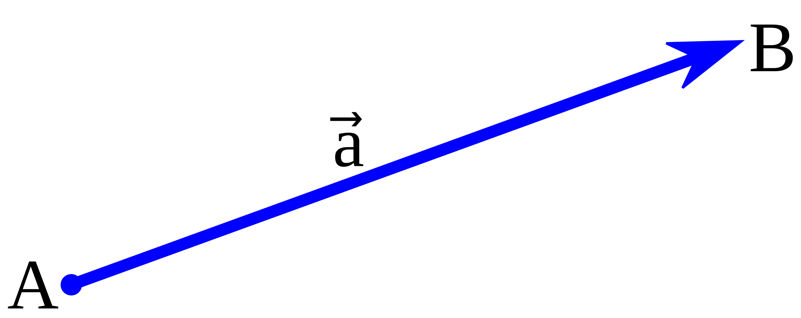

<h2 align=center>Lecture 26</h2>

<h1 align=center>Object-Oriented Programming Review and List Comprehension</h1>

### 16 Frimaire, CCXXXI

***Song of the day***: _[**AXIOM**](https://youtu.be/ZTvaHCtTDc0) by Ai Furihata (2021)._

---

### Part 0: _(Vector) Space Oddity_

In physics and mathematics, a [**vector**](https://en.wikipedia.org/wiki/Euclidean_vector) is a geometric object that 
has a magnitude (or length) and direction.



<sub>**Figure 1**: A two-dimensional vector pointing from  point `A` to `B`. Each point has an x-coordinate and a 
y-coordinate.</sub>

These vectors are often used to represent forces acting on an object. For example, if one person is pushing a box the
north direction, and another person is pushing the same box in the east direction, the resulting **net force** will
cause the box to move somewhere in the northeast direction, with the combined forces of both pushes. In other words,
you can perform _arithmetic on vectors_.

We will be simulating **three-dimensional** vectors using classes.

#### _The `Point` Class_

Since each vector is delineated by two points in 3-dimensional space, we will create a class to represent such a point.

In the file [**point.py**](point.py), create a class called `Point` that will accept 3 argument when being instantiated: 
an x-coordinate, a y-coordinate, and a z-coordinate. These will also be the `Point` objects' arguments:

```python
point_a = Point(-2, -3, 0)

print(point_a.x_coord)
print(point_a.y_coord)
print(point_a.z_coord)

print(point_a)
```

Output:

```text
-2
-3
0
(-2, -3, 0)
```

<sub>Note the behaviour when `Point` objects are printed. Make sure your class behaves the same way.</sub>

`Point` objects must be able to subtract from each other. For example:

```python
point_a = Point(3.0, -0.67, -6)
point_b = Point(34.0, -5.67, -6.06)
point_c = point_b - point_a

print(point_c)
```

Output:

```text
(31.0, -5.0, -0.06)
```

Each of these parameters **must** have a default value of `0.0`.

#### _The `Vector` Class_

In the file [**vector.py**](vector.py), define a class called `Vector`. `Vector` objects will be created by passing in two
`Point` objects as arguments:

```python
from point import Point
from random import randrange

# Creating points with random coordinates
point_a = Point(randrange(-10, 10), randrange(-10, 10), randrange(-10, 10))
point_b = Point(randrange(-10, 10), randrange(-10, 10), randrange(-10, 10))

vector_a = Vector(point_b, point_a)
```

Each `Vector` object will only have one attribute, `vector`, whose value will be the difference between the second 
`Point` parameter and the first `Point` parameter. For example, if the first parameter was a point at the origin `(0, 0, 
0)` and the second parameter was the point `(10.3, 0.0, -3.4)`, the following code:

```python
vector_a = Vector(Point(), Point(10.3, 0.0, -3.4))

print(vector_a.vector)
```

Would print:

```text
`(10.3, 0.0, -3.4)`
```

When printing `Vector` objects, make sure they look as follows:

```python
vector_a = Vector(Point(), Point(10.3, 0.0, -3.4))

print(vector_a)
```

Output:

```text
10.3x + 0.0y - 3.4z
```

<sub>Note here that the signs change with the value of the x-, y-, and z-coordinates.</sub>

---

Once you have gotten your initializer and printing behaviour to work, define a method for the `Vector` class called
`get_magnitude()` which will simply return the value of this vector's magnitude. The magnitude of a vector ***`v`***, 
denoted by the ***`|v|`*** notation, is calculated using the following formula:

> `|v|` = (x<sup>2</sup> + y<sup>2</sup> + z<sup>2</sup>)<sup>0.5

```python
vector_a = Vector(Point(2, 45, 0.0), Point(10.3, 0.0, -3.4))

print(vector_a.get_magnitude())
```

Output:

```text
45.88518279357727
```

---

Finally, make sure your `Vector` objects can **multiply**. For this, we will use the [**dot 
product**](https://en.wikipedia.org/wiki/Dot_product#Algebraic_definition):

> `a` · `b` = (x<sub>a</sub> * x<sub>b</sub>) x + (y<sub>a</sub> * y<sub>b</sub>) y + (z<sub>a</sub> * z<sub>b</sub>) z

```python
# Creating vector A with two points of random coordinates
point_a = Point(randrange(-10, 10), randrange(-10, 10), randrange(-10, 10))
point_b = Point(randrange(-10, 10), randrange(-10, 10), randrange(-10, 10))
vector_a = Vector(point_b, point_a)

# Creating vector B with two points of random coordinates
point_c = Point(randrange(-10, 10), randrange(-10, 10), randrange(-10, 10))
point_d = Point(randrange(-10, 10), randrange(-10, 10), randrange(-10, 10))
vector_b = Vector(point_d, point_c)

print("Vector A: {}".format(vector_a))
print("Vector B: {}".format(vector_b))

dot_product = vector_a * vector_b

print("A · B = {}".format(dot_product))
```

Possible output:

```text
Vector A: -15x - 2y - 7z
Vector B: 2x + 5y + 7z
A · B = -30.0x - 10.0y - 49.0z
```