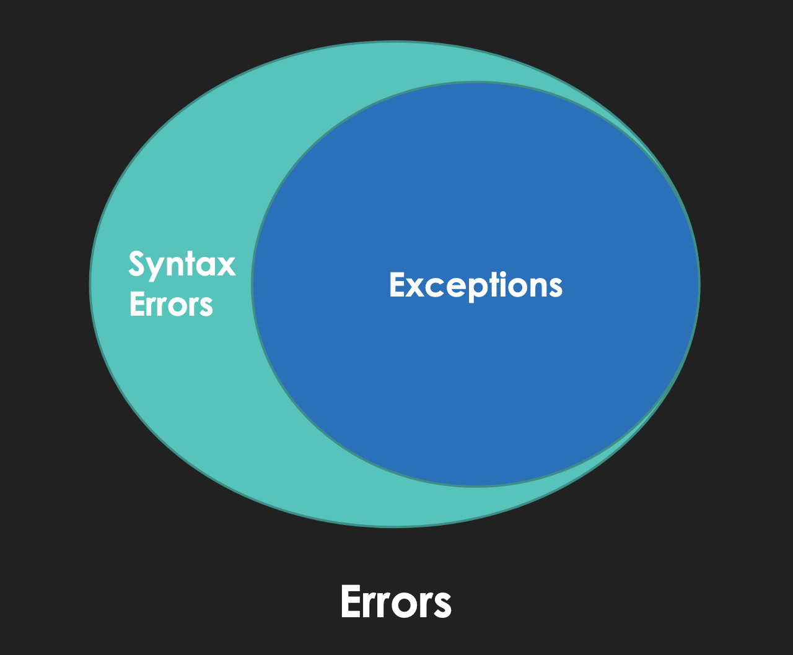

## Lecture 19

# Exceptions and File Output

### 17 Germinal, Year CCXXX

***Song of the day***: _[**Con Te Partiró**](https://youtu.be/-_B4A2yym8k) by Andrea Bocelli (1995)._

---

### Part 1: _Exceptions_

So, when we were looking at files on Monday, I told you to assume that the data that we are reading from our `txt` file
was always going to be valid. That's a cute ideal, but the reality is that most data sources that you will be working
with as a computer scientist will _not_ look the way you want them to. For example, recall our dataset from last class's
file:

```txt
50.98,82.72,89.18,51.57,23.95,69.82
57.7,13.08,1.26,6.15,52.09,42.63,39.46
96.21,43.32,79.45,7.87,10.5,10.92,67.87,21.22
27.27,40.23,79.09,17.56,75.87,80.38,40.98,6.21,44.72,36.45
0.07,29.63,97.73,58.01,97.47,24.07,83.46,99.4
14.03,55.63,31.57,0.01,73.4,91.35,82.06,59.62,2.83,93.04
```
<sub>**Figure 1**: Contents of [**student_grades.txt**](student_grades.csv).</sub>

This data set is quite nice because we can assume that:

- The grades will always be separated by a comma `','`.
- The grades will always be valid numerical strings.

These are some _serious_ assumptions—particularly the third one. What you should expect a real-world file to look like
is like this:

```txt
50.98,82.72,89.18,51.57,23.95,NULL,NULL
57.7,NULL,1.26,6.15,NULL,42.63,39.46
96.21,43.32,NULL,7.87,10.5,10.92,67.87,21.22
27.27,NULL,79.09,17.56,75.87,80.38,40.98,6.21,44.72,36.45
NULL,NULL,NULL,NULL,NULL,NULL,NULL,NULL,NULL,NULL,NULL
14.03,55.63,31.57,0.01,73.4,91.35,82.06,59.62,2.83,93..04
```
<sub>**Figure 2**: Contents of [**student_grades_incomplete.txt**](student_grades_incomplete.csv).</sub>

In other words, we find a good amount of non-numerical values. These can be literally anything—they could be a keyword
that represents a grade being corrupted or missing (such as `NULL` in my example), or maybe the actual numbers will be
invalid numerical values (as is the case with the last number of the last line, `93..04`). And these are errors that you
can catch only because this file is small. What if the file had 10,000+ lines of grades? In short, we need a fool-proof
way to handle situations where our code _might_ fail, so that if it does, we can have a contingency plan instead of
having our whole app crash.

This is the job of ***exceptions***.

So let's work with `student_grades_incomplete.txt`, and see what we can do to handle these potential errors. If we try 
to run [**our previous `get_file_sums()` function**](GetSums.py) using this file, we'll run into the following error:

```python
import sys


def get_line_sum(string, separator=','):
    string = string.split(separator)
    summation = 0

    for element in string:
        element = float(element)
        summation += element

    return summation


def get_file_sums(filepath):
    file_obj = open(filepath, 'r')

    sums = []

    for string in file_obj:
        grades = string.strip()

        summation = get_line_sum(grades, ',')
        sums.append(round(summation, 2))

    file_obj.close()

    return sums


def main():
    filepath = sys.argv[1]
    file_sums = get_file_sums(filepath)
    print(file_sums)

    
if __name__ == '__main__':
    main()
```
Command line call:
```commandline
sebastianromerocruz@Sebastians-MBP Week_11_2 % python3 GetSums.py student_grades_incomplete.txt
```
Output:
```commandline
Traceback (most recent call last):
  File "GetSums.py", line 94, in <module>
    main()
  File "GetSums.py", line 87, in main
    file_sums = get_file_sums(filepath)
  File "GetSums.py", line 62, in get_file_sums
    summation = get_line_sum(grades, FILE_SEPARATOR)
  File "GetSums.py", line 23, in get_line_sum
    element = float(element)
ValueError: could not convert string to float: 'NULL'
```

You'll see that we get this error. Naturally, we can't convert the string `"NULL"` into a `float`, so the code crashes.
What's interesting about error messages is that, even though the error occurs in line 23, inside the function 
`get_line_sum()`, the `ValueError` signal gets ***sent up*** from `get_line_sum()` to line 62 in the function
`get_file_sums()`, and then again from `get_file_sums()` to the `main()` in line 87, etc..

In other words, **the `ValueError` is sent from its location, all the way up its call stack**; `main()` calls, 
`get_file_sums()`, and `get_file_sums()` calls `get_line_sum()`, where the error occurs. This is useful because, if we
have an effective way of handling errors, our program will be aware of this error all the way to the very top, and not
completely break down.

---

Before we get into how to handle errors, we should take a look at what kind of errors there are, and which ones we _can_
actually handle:

> **Error**: Any "problem in a program".
> 
> **Syntax Error**: Problems resulting from the way the sequence of characters in source code is written.
> 
> **Exceptions**: Errors detected during program execution which are not _unconditionally_ fatal. This, in other words, 
> means that we can handle them. [**Here's**](https://docs.python.org/3/library/exceptions.html#concrete-exceptions) a 
> list of them.


<sub>**Figure 3**: The scope of exceptions within all types of Python errors._</sub>

Alright, _now_ we're ready. Say hello to the `try`-`catch`-`else`-`finally` structure, `try`-`catch` for short.

### Part 2: _The `try`-`catch`-`else`-`finally` Structure_

This is our last control-flow structure, and it has the following general format:

```python
try:
    # code that CAN fail
except exception_name:
    # what to do IF it DOES fail
else:
    # what to do if it DOESN'T fail
finally:
    # what to do REGARDLESS of whether it does or does not fail
```

Here's a simple example. Let's say we had a list of elements, and we asked the user to enter an integer to be used to 
index a list:

```python
hkgtt = ["Yui", "Mio", "Ritsu", "Mugi", "Azuza"]
user_index = int(input("Enter a band member index ({}-{} only): ".format(0, len(hkgtt) - 1)))
member = hkgtt[user_index]

print("FETCHING MEMBER NANE...")
print("The #{} member is {}.".format(user_index, member))
print("\nPROGRAM FINISHED.")
```

Output:

```text
Enter a band-member index (0-4 only): 3
FETCHING MEMBER NANE...
The #3 member is Mugi.
PROGRAM FINISHED.
```

That works perfectly fine, but of course, we must ***never*** assume that the user will enter the expected value. The 
fact of the matter is that most people will fail at grasping the correct use of any program/app/interface the first time
around. So this could easily happen:

````text
Enter a band-member index (0-4 only): 10
Traceback (most recent call last):
  File "<input>", line 3, in <module>
IndexError: list index out of range
````

Or even this:

```text
Enter a band-member index (0-4 only): >? the first one
Traceback (most recent call last):
  File "<input>", line 2, in <module>
ValueError: invalid literal for int() with base 10: 'the first one'
```

Both are perfectly likely possibilities, and we don't want our program to crash just because the user might not 
understand an unfamiliar interface right away; it just simply isn't their fault. So, let's use 
`try`-`catch`-`else`-`finally` to end the program gracefully even if the user enters the wrong thing:

```python
hkgtt = ["Yui", "Mio", "Ritsu", "Mugi", "Azuza"]
user_index = int(input("Enter a band member index ({}-{} only): ".format(0, len(hkgtt) - 1)))

print("FETCHING MEMBER NANE...")
try:
    # code that CAN fail
    member = hkgtt[user_index]
except IndexError:
    # what to do IF it DOES fail; index too large
    print("WARNING: There is no #{} member.".format(user_index))
else:
    # what to do if it DOESN'T fail
    print("The #{} member is {}.".format(user_index, member))
finally:
    # what to do REGARDLESS of whether it does or does not fail
    print("\nPROGRAM FINISHED.")
```
Outputs:
```text
Enter a band member index (0-4 only): >? 10
WARNING: There is no #10 member.
PROGRAM FINISHED.
```
```text
Enter a band member index (0-4 only): >? 1
FETCHING MEMBER NANE...
The #1 member is Mio.
PROGRAM FINISHED.
```

Awesome. Now our program doesn't crash if the user enters an index that is too high.

We can also have multiple `catch` blocks, in the case that mulitple things can go wrong. For example, `int()` can only 
convert strings that contain integers, and nothing else. So let's account for that:

```python
hkgtt = ["Yui", "Mio", "Ritsu", "Mugi", "Azuza"]
user_index = input("Enter a band member index ({}-{} only): ".format(0, len(hkgtt) - 1))

print("FETCHING MEMBER NANE...")
try:
    # code that CAN fail
    user_index = int(user_index)
    member = hkgtt[user_index]
except ValueError:
    # what to do IF it DOES fail; index is not an integer
    print("WARNING: Indeces must be integers.")
except IndexError:
    # what to do IF it DOES fail; index too large
    print("WARNING: There is no #{} member.".format(user_index))
else:
    # what to do if it DOESN'T fail
    print("The #{} member is {}.".format(user_index, member))
finally:
    # what to do REGARDLESS of whether it does or does not fail
    print("\nPROGRAM FINISHED.")
```

[**Here's**](exceptions.py) the complete program.

---

Now, back to getting the sums of the grades. There's a couple of places where our program could go awry:

- In `get_line_sum()`, the line `element = float(element)` will fail is any of the grades is non-numerical.
- In `get_file_sums()`, the line `file_obj = open(filepath, READ_MODE)` can and will fail is the file specified by 
`filepath` **does not exist**. This is by far the most common instance of exception catching that we'll see in this 
course.

Alright, let's take care of those errors and change our [**program**](GetSumsEnhanced.py):

```python
def get_line_sum(string, separator=DEFAULT_SEPARATOR):
    """
    Gets the sum of a string of numbers separated by a single space. Assumes valid input.

    :param separator: Separator to use in string when splitting
    :param string: A string containing numbers separated by a space
    :return: The sum of such numbers
    """
    string = string.split(separator)
    summation = 0

    for element in string:
        try:
            element = float(element)
        except ValueError:
            print("WARNING: Non-numerical grade found ({}) and ignored.".format(element))
        else:
            summation += element

    return summation


def get_file_sums(filepath):
    """
    Returns a list of tuples containing the sum of the grades of students, each identifies by an ID, contained in a text
    file.

    :param filepath: A string containing the path of a text file
    :return: A list of tuples
    """
    try:
        file_obj = open(filepath, READ_MODE)
    except FileNotFoundError:
        print("WARNING: File {} not found. Returning empty list.")
        return []

    sums = []

    for string in file_obj:
        string = string.split()
        student_id = string[ID_IDX]
        grades = string[GRADES_IDX]

        summation = get_line_sum(grades, FILE_SEPARATOR)
        student_info = (student_id, round(summation, DECIMAL_PRECISION))
        sums.append(student_info)

    file_obj.close()

    return sums
```

Very nice. Let's put it to the test.

<sub>**Example #1**: Everything goes smoothly with a clean file.</sub>

```python
def main():
    filepath = ARGUMENTS[FILE_ARG_IDX]
    file_sums = get_file_sums(filepath)
    print(file_sums)

main()
```

Output:

```text
sebastianromerocruz@10-18-158-42 Week_11_2 % python3 GetSumsEnhanced.py student_grades.txt
[('001', 368.22), ('002', 212.37), ('003', 337.36), ('004', 448.76), ('005', 489.84), ('006', 503.54)]
```

<sub>**Example #2**: The user enters a filename that doesn't exist.</sub>

```python
def main():
    filepath = "not_a_real_file.txt"
    file_sums = get_file_sums(filepath)
    print(file_sums)

main()
```
Output:
```text
sebastianromerocruz@10-18-158-42 Week_11_2 % python3 GetSumsEnhanced.py student_grades.txt
WARNING: File not_a_real_file.txt not found. Returning empty list.
[]
```
<sub>**Example #3**: The [**file**](student_grades_incomplete.csv) exists, but it has corrupted data.</sum>

```python
def main():
    filepath = ARGUMENTS[FILE_ARG_IDX]  # using corrupted file
    file_sums = get_file_sums(filepath)
    print(file_sums)

main()
```
Output:
```text
sebastianromerocruz@10-18-158-42 Week_11_2 % python3 GetSumsEnhanced.py student_grades_incomplete.txt 
WARNING: Non-numerical grade found (NULL) and ignored.
WARNING: Non-numerical grade found (NULL) and ignored.
WARNING: Non-numerical grade found (NULL) and ignored.
WARNING: Non-numerical grade found (NULL) and ignored.
WARNING: Non-numerical grade found (NULL) and ignored.
WARNING: Non-numerical grade found (NULL) and ignored.
WARNING: Non-numerical grade found (NULL) and ignored.
WARNING: Non-numerical grade found (NULL) and ignored.
WARNING: Non-numerical grade found (NULL) and ignored.
WARNING: Non-numerical grade found (NULL) and ignored.
WARNING: Non-numerical grade found (NULL) and ignored.
WARNING: Non-numerical grade found (NULL) and ignored.
WARNING: Non-numerical grade found (NULL) and ignored.
WARNING: Non-numerical grade found (NULL) and ignored.
WARNING: Non-numerical grade found (NULL) and ignored.
WARNING: Non-numerical grade found (NULL) and ignored.
WARNING: Non-numerical grade found (NULL) and ignored.
WARNING: Non-numerical grade found (93..04) and ignored.
[('001', 298.4), ('002', 147.2), ('003', 257.91), ('004', 408.53), ('NULL', 0), ('006', 410.5)]
```

### Part 3: _File Access_

Let's say that your favorite video game distribution service keeps track of your playtime stats in a 
[**CSV**](https://en.wikipedia.org/wiki/Comma-separated_values#Example) file, such as [**this one**](library.csv):

```csv
Title,Last Played,Play Time (hrs),Achievements
Omori,10/29/21,16.5,16/84
Portal 2,04/28/16,5.7,16/51
Civilization V,09/04/18,22.9,20/286
Hyper Light Drifter,04/04/18,15.5,4.23
Kindred Spirits on the Roof,10/30/21,1.5,NULL
TIS-100,04/29/19,10.6,1/10
```

As you can see, the first line (header), gives us information as to what each of these values represents:

| **Title**                   | **Last Played** | **Play Time (hrs)** | **Achievements** |
|-----------------------------|-----------------|---------------------|------------------|
| Omori                       | 10/29/21        | 16.5                | 16/84            |
| Portal 2                    | 04/28/16        | 5.7                 | 16/51            |
| Civilization V              | 09/04/18        | 22.9                | 20/286           |
| Hyper Light Drifter         | 04/04/18        | 15.5                | 4.23             |
| Kindred Spirits on the Roof | 10/30/21        | 1.5                 | NULL             |
| TIS-100                     | 04/29/19        | 10.6                | 1/10             |

<sub>**Figure 4**: Table representation of the data in [**library.csv**](library.csv).</sub>

What if we wanted to create a report for our user that includes only the titles and play times of the games, in order of
most played to least played? For this, we obviously have to access [**library.csv**](library.csv), a file. We learned 
last week that files can be accessed (opened) using the built-in `open()` function. We learned about read-mode `'r'`, 
but if we're going to create this report and, ideally, put it on a different file, we're going to need to learn a couple
of other access modes:

| **Mode** | **Description**                                                 | **Example**                                |
|----------|-----------------------------------------------------------------|--------------------------------------------|
| `'r'`    | Open for reading (default)                                      | `open(filename, 'r')`, or `open(filename)` |
| `'w'`    | Open for writing, truncating the file first                     | `open(filename, 'w')`                      |
| `'a`'    | Open for writing, appending to the end of the file if it exists | `open(filename, 'a')`                      |

<sub>**Figure 5**: [**Access modes**](https://docs.python.org/3/library/functions.html#open) for the `open()` function. 
***Only use these three modes in this class***.</sub>

Sounds like we have everything we need. Let's perform our steps that we learned last class. Let's first open 
[**library.csv**](library.csv) to extract our information from it. Since we're going to be doing some sorting by play
time, it might be useful to get each line as the element of a list. Title is a string, and playtime is a `float`, so 
let's write a quick function that parses a single line from the file and returns a tuple of this information:

```python
DATUM_QUANTITY = 4
TITLE_IDX = 0
PLAYTIME_IDX = 2


def parse_information(line):
    lst = line.strip().split(',')

    if len(lst) != DATUM_QUANTITY:
        raise ValueError("Line '{}' does not have enough values.".format(line))

    title = lst[TITLE_IDX]

    try:
        playtime = float(lst[PLAYTIME_IDX])
    except:
        raise ValueError("Playtime value in line '{}' is non-numerical".format(lst[PLAYTIME_IDX]))

    return title, playtime
```

Awesome. Now we have a function that will guarantee us a valid tuple from a line every time. If the program crashes, it
is not the program's fault, but rather the data source's.

Let's now use this function to get the whole library's contents:

```python
def get_library_contents(filepath):
    library = []

    # Step 1: Attempt to safely open our file, return empty list if file doesn't exist
    try:
        library_file = open(filepath, 'r')
    except FileNotFoundError:
        print("WARNING: File {} does not exist. Returning empty list.")
        return library

    # Step 2: Get rid of the header
    library_file.readline()

    # Step 4: Close your file. Please.
    library_file.close()

    # Step 5: Return library information
    return library
```

If we test this function with `library.csv`, we get the following pretty-printed output:

```text
[('Omori', 16.5),
 ('Portal 2', 5.7),
 ('Civilization V', 22.9),
 ('Hyper Light Drifter', 15.5),
 ('Kindred Spirits on the Roof', 1.5),
 ('TIS-100', 10.6)]
```

Perfect. Now, we need to sort this list in descending order. 
[**Sorting**](https://en.wikipedia.org/wiki/Sorting#Sorting_information_or_data) is kind of its own massive computer 
science topic (something that you will unfortunately find out next semester in data structures and algorithms), so I've
gone ahead and written a little function that will sort our tuple list the way we want it. It takes three parameters,
the list of tuples we want to sort, the index of the value we want to sort the list by (in our case, that index is 1, 
since that's the location of the playtime), and whether we want the list to be in descending order or not:

```python
import TupleSort

tuple_list = [
    ('Omori', 16.5),
    ('Portal 2', 5.7),
    ('Civilization V', 22.9),
    ('Hyper Light Drifter', 15.5),
    ('Kindred Spirits on the Roof', 1.5),
    ('TIS-100', 10.6)
]

# Sort tuple_list by the first index (play time) in place, in descending order
TupleSort.tuple_sort(tuple_list=tuple_list, sort_index=1, descending=True)

print(tuple_list)
```

Output:

```text
[('Civilization V', 22.9),
 ('Omori', 16.5),
 ('Hyper Light Drifter', 15.5),
 ('TIS-100', 10.6),
 ('Portal 2', 5.7),
 ('Kindred Spirits on the Roof', 1.5)]
```

Alright, so all that's left now is to write this report by creating a new file. As we learned earlier, we can create
a new file, ready to have data written to it, simply by using write mode `w`:

```python
def create_report(library_information, report_filename="report.csv"):
    # Step 1: Open the file.
    report_file = open(report_filename, 'w')

    # Step X: Close the file.
    report_file.close()
```

If the file denoted by `filename` doesn't already exist, **write mode `w` will create it for you**. Be careful though,
if the file does exist ***write mode `w` will overwrite the previous contents of the file***.

So, how do we write lines into `report_file`? There's a couple of ways to go about it: the "Pythonic way", and the more
language-agnostic way. Let's look at the Pythonic way first:

```python
def create_report(library_information, report_filename="report.csv"):
    # Step 1: Open the file.
    report_file = open(report_filename, 'w')

    # Step 2: Write the header into report_file using the print() function
    print("Title,Play Time (hrs)", end='\n', file=report_file)
```

That's right; the `print()` function can be used to write into files. You can think of `print()`'s default `file` 
argument to be the Terminal/command line—all it essentially does is take pieces of information from a source, and 
displays them somewhere else. In this case, that "somewhere else" is in the file specified by `file=report_file`. Don't
forget to specify that the line will end with a new line using `end='\n'`. Otherwise, you'll end up with a single line
containing all your file's information.

(Note: Your output files don't necessarily need a header—it is purely a matter of preference.)

So now, let's use `print()` to write each of the lines based on the contents of `library_information`. Since the file
that we're writing is a `csv` file, we can also take advantage of `print()`'s `sep` parameter by setting it to be a
comma `,`!

```python
def create_report(library_information, report_filename="report.csv"):
    # Step 1: Open the file.
    report_file = open(report_filename, 'w')

    # Step 2: Write the header into report_file using the print() function
    print("Title,Play Time (hrs)", end='\n', file=report_file)

    # Step 3: Iterate through each of the tuples
    for game_information in library_information:
        # Step 4: Write the line into report_file using the print() function
        game_title = game_information[0]
        game_playtime = game_information[1]
        print(game_title, game_playtime, sep=',', end='\n', file=report_file)

    # Step 5: Close the file.
    report_file.close()
```