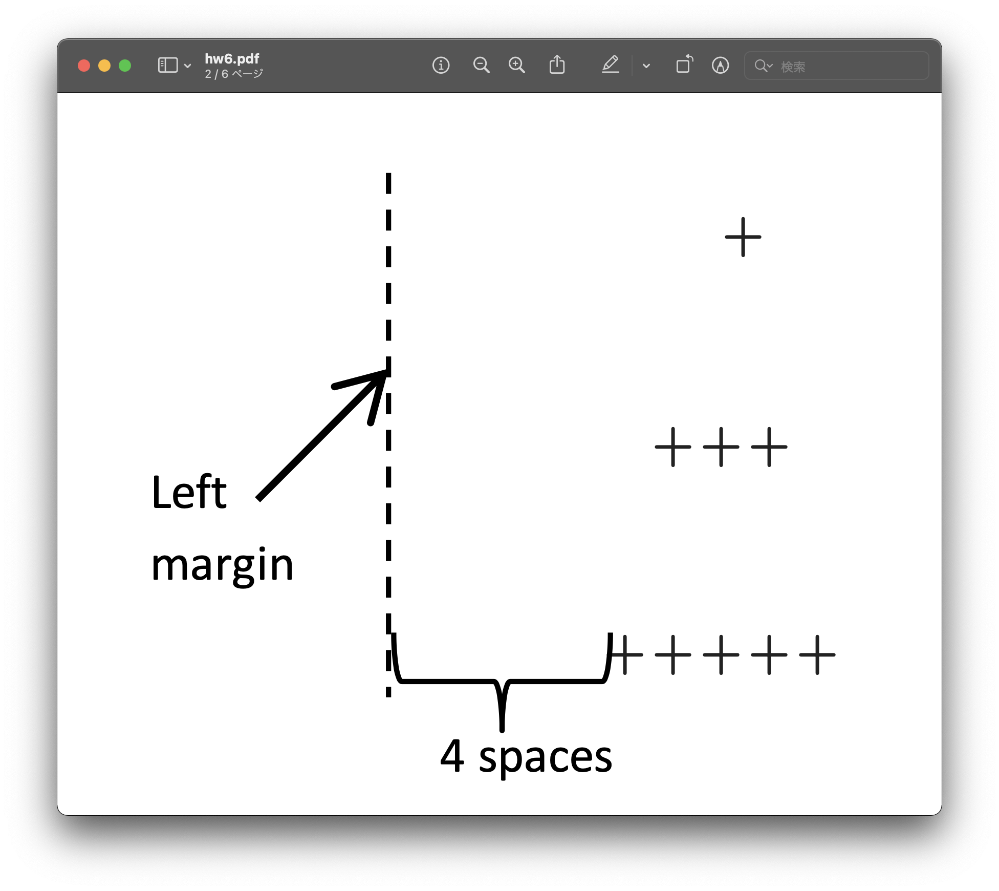
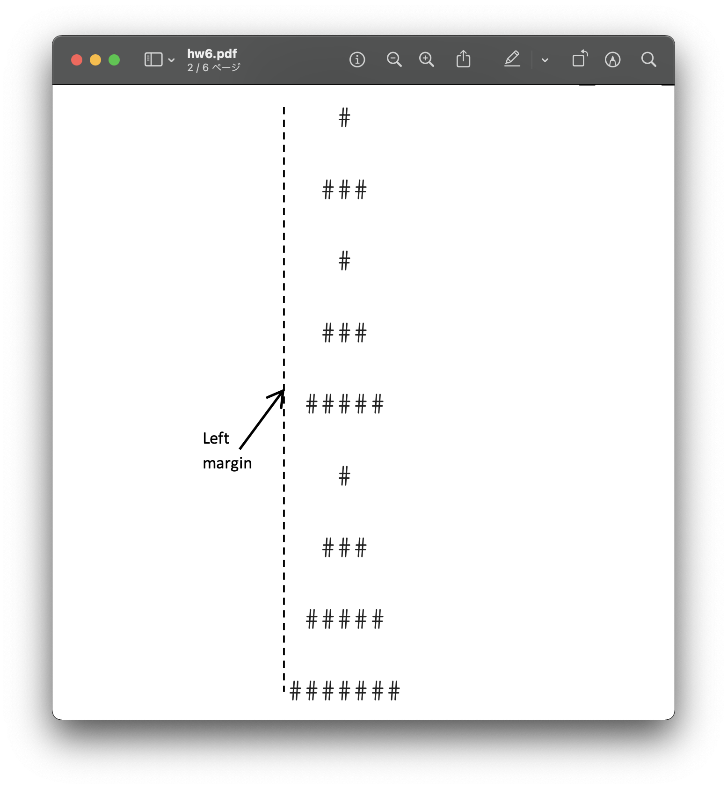

<h2 align=center>Lecture 15</h2>

<h1 align=center>The `return` Statement</h1>

### 4 Brumaire, Year CCXXXI

***Song of the day:*** _[**Ain't Nobody Know**](https://youtu.be/deIS1BmSfZQ) by Gen Hoshino (2020)._

---

### Sections

1. [**Simply Having A Functional Christmas Time**](#part-0-simply-having-a-functional-christmas-time)
2. [**The `print()` Function's Parameters and Default Parameters**](#part-1-the-print-functions-parameters-and-default-parameters)
3. [**The `return` Statement**](#part-2-the-return-statement)

### Part 0: _Simply Having A Functional Christmas Time_

Write a program that prints a "pine tree". This pine tree will consist of triangles of increasing sizes, drawn using 
with a user-inputted character (e.g. `*`, `+`, `$`, etc.). Your program **must** consist of the following three 
functions:

- `print_shifted_triangle(height, margin, symbol)`: This function will print a `height`-line triangle, filled with
`symbol` characters, shifted to the right by a `margin` number of spaces. For example, check out the following function
call and its respective expected output:

```python
print_shifted_triangle(3, 4, '+')
```

```text
       +
      +++
     +++++
```



<sub>**Figure 1**: A screenshot of what your output should look like if the line `print_shifted_triangle(3, 4, '+')` is
run. Note that only the `'+'` characters should be visible. The dotted lines, arrows, and labels are only there for
your clarity.<sub>

- `print_pine_tree(levels, symbol)`: This function will print a sequence of `levels` number of triangles of increasing
sizes, forming a "pine tree". The triangles will be drawn using the `symbol` character. You must naturally make use of 
the `print_shifted_triangle()` function we wrote above. For example, check out the following function call and its 
respective expected output:

```python
print_pine_tree(3, '#')
```

```text
   #
  ###
   #
  ###
 #####
   #
  ###
 #####
#######
```



<sub>**Figure 2**: A screenshot of what your output should look like if the line `print_pine_tree(3, '#')` is run. Note,
again, that only the `'#'` characters should be visible. The dotted lines, arrows, and labels are only there for your 
clarity.<sub>

- `main()`: This driver function will interact with the user and ask them to enter a **valid** character to use for our
output, and a **positive** integer for the number of levels that our tree will have. 
  - Your program must continue asking
  the user to input a valid character in such case that they enter an invalid character, and for a non-zero positive 
  integer in such case that the user enters zero or a negative number. 
  - Valid characters are limited to **non-alphanumeric, 
  [**non-whitespace**](https://docs.python.org/3/library/stdtypes.html#str.isspace) characters**. You may assume that 
  the user will always enter integers and valid strings.

```text
Enter a positive, non-zero, integer: 4
Enter a non-whitespace, non-alphanumeric character: /
    /
   ///
    /
   ///
  /////
    /
   ///
  /////
 ///////
    /
   ///
  /////
 ///////
/////////
```

[**Here's**](solution/christmastime.py) the full solution.

### Part 1: _The `print()` Function's Parameters and Default Parameters_

Speaking of parameters, what are the `print()` function's parameters? Since we'll be basically using `print()` for the 
rest of our programming lives, it stands to reason that we get as well acquainted with it as possible.

If we simply pass objects as arguments into the `print()` function, we know that it will print the values of those
objects, separated by a single space (`" "`)

```python
first_call = 3
second_call = 2
final_call = 1
start = 0
print(first_call, second_call, final_call, start)
```

Output:

```text
3 2 1 0
```

So why does Python separate these arguments by a space? It turns out that the `print()` function has a "hidden" 
parameter called `sep` (short for separator) *whose default value is an single space*. Because this is the default the 
value, `print()` will take every argument we passed to it, and print them in order, separated by a space.

If we wanted to change the value of the `print()` function's separator, we would do something like this:

```python
first_call = 3
second_call = 2
final_call = 1
start = 0
print(first_call, second_call, final_call, start, sep="...")
```

Output:

```text
3...2...1...0
```

Here, we've told the `print()` function to replace its default separator for the string `"..."`. Notice that we have to
explicitly type `sep=` in order to change the separator. Don't forget to do so—`print()` will just assume that it is 
another parameter to `print()`.

To generalize this behavior, here's what the `print()` function's definition's signature probably looks like:

```python
def print(object1, object2, …, sep=' '):
    # more code
    # more code
```

Giving a parameter a value in the function signature gives it a **default** value. These are useful when you have 
functions that give the user the option of entering their own value if they choose to do so. If they don't, the function
will use the default parameter:

```python
def make_french_fries(number_of_orders, uses_air_frier=False):
    if uses_air_frier:
        print("Making", number_of_orders, "french fries orders using an oil frier.")
    else:
        print("Making", number_of_orders, "french fries orders using an air frier.")

def main():
    make_french_fries(10)
    make_french_fries(7, True)
    make_french_fries(3, uses_air_frier=True)
    make_french_fries(number_of_orders=20, uses_air_frier=False)

main()
```

<sub>**Code block 1**: These are all valid function calls for `make_french_fries()`.</sub>

Output:

```text
Making 10 french fries orders using an air frier.
Making 7 french fries orders using an oil frier.
Making 3 french fries orders using an oil frier.
Making 20 french fries orders using an air frier.
```

We'll revisit `print()` to talk about more of its optional parameters, but this is all we need for the time being.

### Part 2: _The `return` Statement_

Remember how the `range()` function accepted arguments for its start, stop, and step values, and then gave us back a
sequence based on those numbers?

```python
def main():
    zero_to_ten_evens = range(0, 11, 2)

    print("The numbers inside this sequence are...")
    for number in zero_to_ten_evens:
        print(number)

main()
```

Output:

```text
The numbers inside this sequence are...
0
2
4
6
8
10
```

That is, we set the variable `zero_to_ten_evens` to `range(0, 11, 2)`, but the actual value that this is equivalent to
is a sequence from 0 to 11 with a step of two.

This is one way this can be said in English:

> The function `range()`, when given the arguments `0`, `11`, and `2`, ***returns*** a sequence from 0 to 11 with a step
> of two to the variable `zero_to_ten_evens`.

This is certainly not the only built-in Python function that we have seen that shows this behavior. Consider the
`input()` function; in English, you would say:

>> The function `input()`, when given user input as an argument, ***returns*** the string equivalent of that user input.
> 
>> The function `int()`, when given a string containing an integer as an argument, ***returns*** the `int` equivalent
> of that string input.

You can probably see where this is going: functions can return values. So far, all of our functions have either works in
isolation of the outside world (i.e. do not accept parameters), or accept data from the outside world through 
parameters and then use that data inside the function (see code block 2 for an example of this).

We've thus far only printed the results of our functions, but more often than not, you'll want your functions to 
actually ***return*** the result to the outside world so that you can use that result in other unrelated calculations.
(the `input()` function would be pretty useless if all it did was print our input again, and not actually let us save 
it in a variable).

Let's modify the code from code block 2 to return the result of out volume calculations:

```python
PI = 3.1415


def get_cylinder_volume(radius, height):
    """
    Calculates the volume of a cylinder of a given radius and height.
    
    :param radius: A float or integer representing the radius of the bases
    :param height: A float or integer representing the height of the cylinder
    :return: volume: A float representing the volume of our cylinder.
    """
    volume = PI * (radius ** 2) * height

    return volume


def main():
    sample_radius = 5
    sample_height = 1.4
    get_cylinder_volume(sample_radius, sample_height)


main()
```

That's it. Notice though, that our doctstring also changed, because now we're actually returning something, so by 
convention we usually write the name of the returned variable, and a short explanation.

<sub>**Code block 2**: `print_cylinder_volume()` is now `get_cylinder_volume()`.</sub>

Now, if we ran this, nothing would show up in our Terminal screen. Why? Because we're no longer printing anything.
`get_cylinder_volume()` calculates the volume of our cylinder and returns it. The problem is that we're not saving that 
returned value anywhere. Exactly the same way that we need to save the returned value from the `input()` function, we 
need to save the returned value from `get_cylinder_volume()` in a variable in order to use it:

```python
PI = 3.1415


def get_cylinder_volume(radius, height):
    """
    Calculates the volume of a cylinder of a given radius and height.
    
    :param radius: A float or integer representing the radius of the bases
    :param height: A float or integer representing the height of the cylinder
    :return: volume: A float representing the volume of our cylinder.
    """
    volume = PI * (radius ** 2) * height

    return volume


def main():
    sample_radius = 5
    sample_height = 1.4
    cylinder_volume = get_cylinder_volume(sample_radius, sample_height)  # our result is being stored here
    
    print("The volume of the cylinder is", cylinder_volume)  # our result is being used here

main()
```