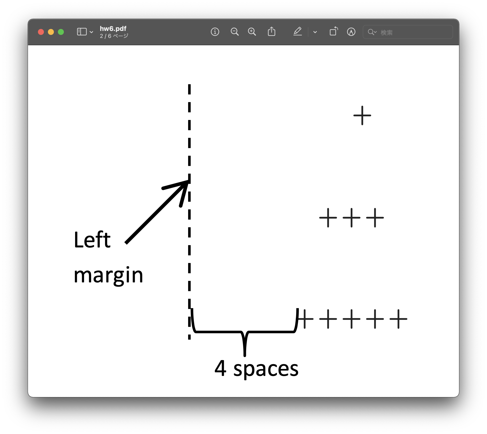
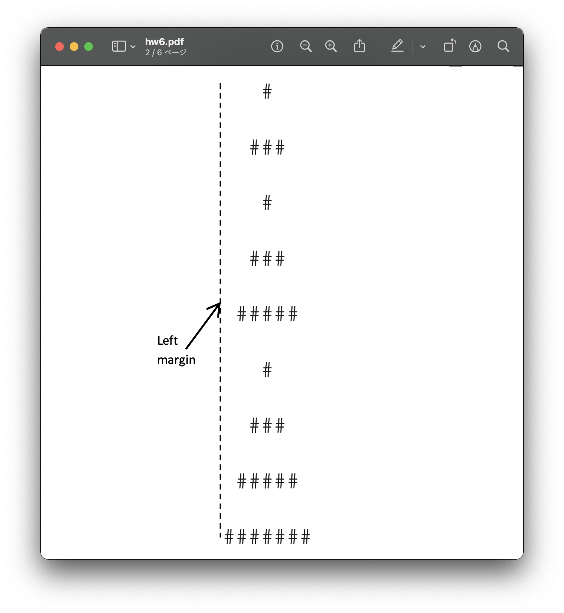

# Review: _Simply Having A Functional Christmas Time_

Write a program that prints a "pine tree". This pine tree will consist of triangles of increasing sizes, drawn using 
with a user-inputted character (e.g. `*`, `+`, `$`, etc.). Your program **must** consist of the following three 
functions:

1. [**`print_shifted_triangle(height, margin, symbol)`**](#print_shifted_triangleheight-margin-symbol)
2. [**`print_pine_tree(levels, symbol)`**](#print_pine_treelevels-symbol)
3. [**`main()`**](#main)

---

### `print_shifted_triangle(height, margin, symbol)`

This function will print a `height`-line triangle, filled with `symbol` characters, shifted to the right by a `margin` number of spaces. For example, check out the following function call and its respective expected output:

```python
print_shifted_triangle(3, 4, '+')
```

```text
       +
      +++
     +++++
```



<sub>**Figure 1**: A screenshot of what your output should look like if the line `print_shifted_triangle(3, 4, '+')` is
run. Note that only the `'+'` characters should be visible. The dotted lines, arrows, and labels are only there for
your clarity.<sub>

### `print_pine_tree(levels, symbol)`

This function will print a sequence of `levels` number of triangles of increasing sizes, forming a "pine tree". The triangles will be drawn using the `symbol` character. You must naturally make use of the `print_shifted_triangle()` function we wrote above. For example, check out the following function call and its respective expected output:

```python
print_pine_tree(3, '#')
```

```text
   #
  ###
   #
  ###
 #####
   #
  ###
 #####
#######
```



<sub>**Figure 2**: A screenshot of what your output should look like if the line `print_pine_tree(3, '#')` is run. Note, again, that only the `'#'` characters should be visible. The dotted lines, arrows, and labels are only there for your clarity.<sub>

## `main()`

This driver function will interact with the user and ask them to enter a **valid** character to use for our output, and a **positive** integer for the number of levels that our tree will have. 
  - Your program must continue asking the user to input a valid character in such case that they enter an invalid character, and for a non-zero positive integer in such case that the user enters zero or a negative number. 
  - Valid characters are limited to **non-alphanumeric, [**non-whitespace**](https://docs.python.org/3/library/stdtypes.html#str.isspace) characters**. You may assume that the user will always enter integers and valid strings.

```text
Enter a positive, non-zero, integer: 4
Enter a non-whitespace, non-alphanumeric character: /
    /
   ///
    /
   ///
  /////
    /
   ///
  /////
 ///////
    /
   ///
  /////
 ///////
/////////
```