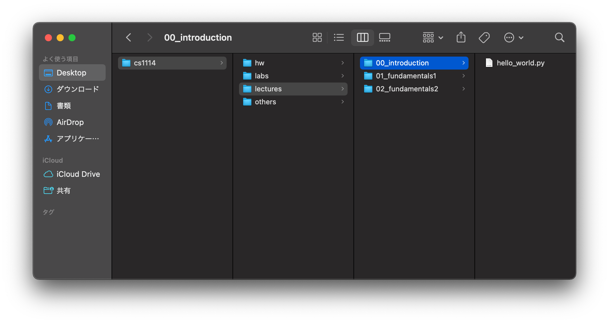
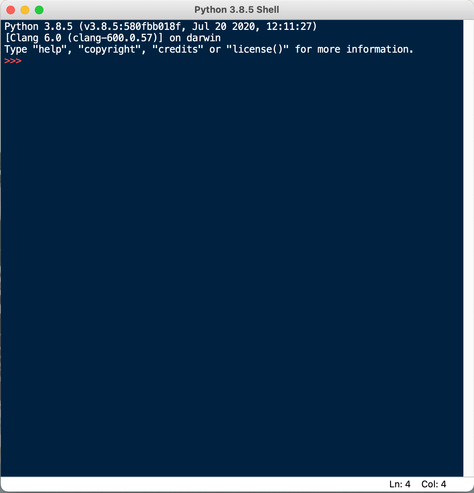
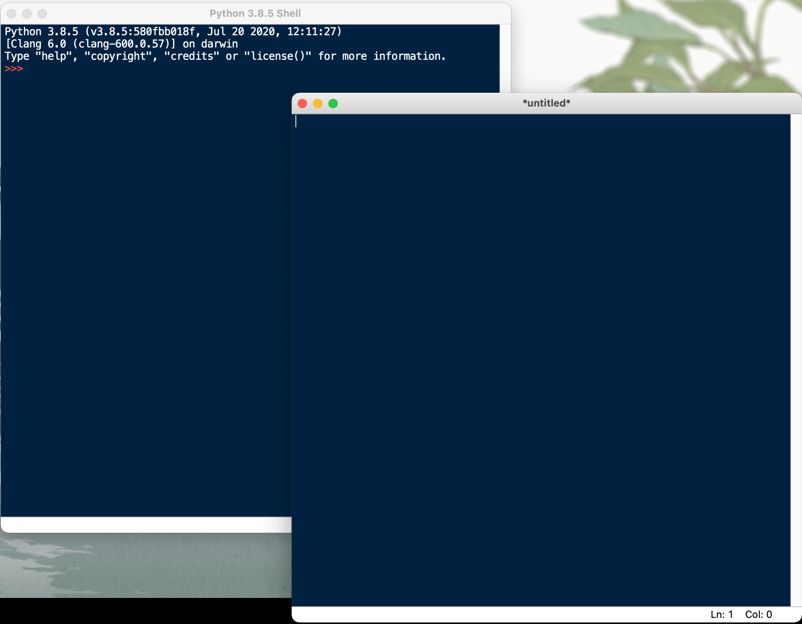
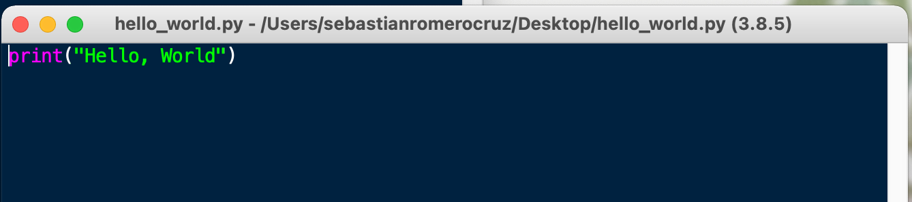
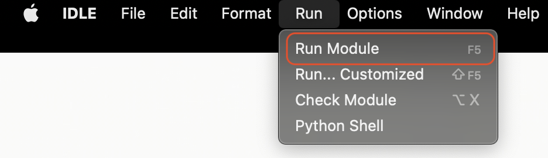
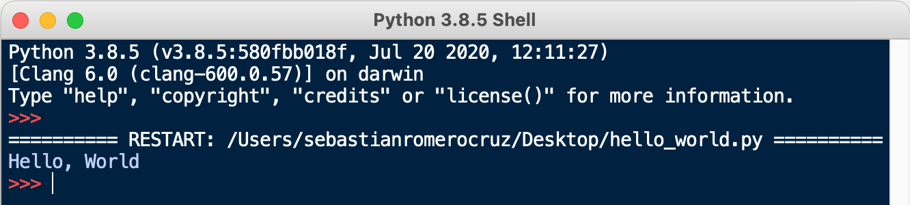
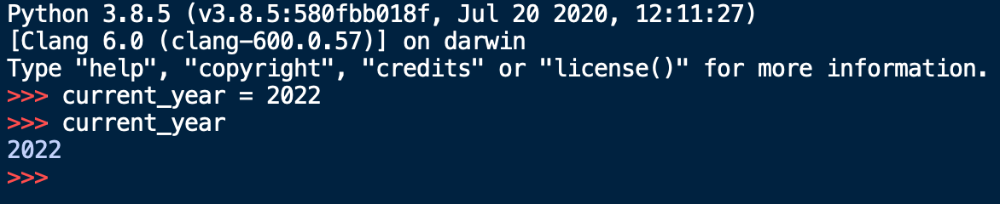
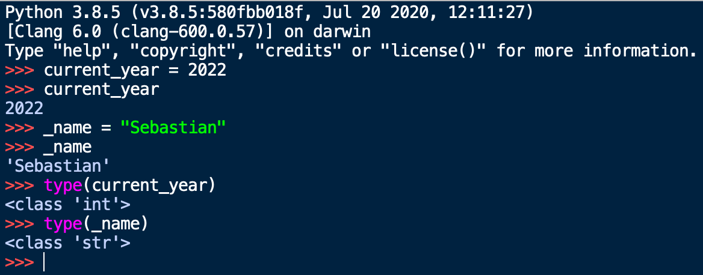
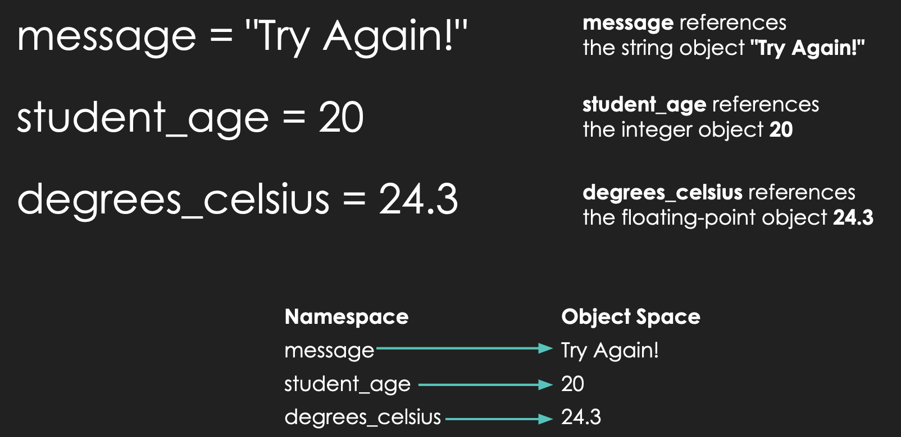

<h2 align=center>Lecture 02</h2>

<h1 align=center>Programming Fundamentals: Values, Types, and Variables</h2>

<h3 align=center>5 Pluviôse, Year CCXXXI</h3>

***Song of the day***: _[**Dances**](https://youtu.be/7NvcYGIDQfc) by Воплі Відоплясова (BB) (1993)_

---

### Part 0: _Getting Organised_

One of the most underrated strategies for succeeding in this course is staying organised; keeping your files in places where you can readily find them will help you more than I can express in writing—you really have to see it to believe it. Go ahead and create a folder structure that looks like this:

```
cs1114
 │
 ├── hw
 │   └── assignment_1
 ├── labs
 │   ├── 00
 │   └── 01
 ├── lectures
 │   ├── 00_introduction
 │   │   └── hello_world.py
 │   ├── 01_fundamentals1
 │   └── 02_fundamentals2
 └── others
```


<sub>**Figures 1 and 2**: Your folder structure should look like this. You don't need to actually create the `hello_world.py` file yet. I just added it for illustration purposes.</sub>

You don't have to follow my naming convention (in fact, I use three different naming conventions above), but I strongly encourage you to find one that you like and stick to it. A couple of heuristics to follow when doing this are:

1. Do _not_ use spaces in the names of your folders and files. This will make more sense later in the semester, but spaces are poorly handled programmatically. If your file/folder name contains a space (` `), use underscores between words (i.e. `something_like_this`) or simply don't use spaces at all.
2. Try to pick a naming convention that can be _easily sorted_. That is, putting numbers at the beginning of your folder names will allow you to sort them by that specific number.

That taken care of, let's take a look at IDLE, the canonical starting point with Python IDEs.

### Part 1: _Parts of a Program_

The moment you open IDLE up. You will be met with the following window:



<sub>**Figure 3**: Your console, the IDLE Shell.</sub>

In order to create a new Python file (i.e. a file with the `.py` extension), you should navigate to the following menu:


<sub>**Figure 4**: Creating a new `py` file.</sub>

Clicking on `New File` will open a blank `py` file close to your console:



<sub>**Figure 5**: A blank `py` file (right).</sub>

We can then write a program, such as this simple _Hello, World!_, and **save the file** anywhere on your computer. In my
case, I saved it on my Desktop, but I ***highly*** recommend creating a dedicated folder for this class.



<sub>**Figure 6**: The canonical _Hello, World!_ program in Python.</sub>

To run our program, we have to navigate to the following top menu option:



<sub>**Figure 7**: Click on `Run Module` to run your code.</sub>

The window should switch over to the console, showing you the result of running your program:



<sub>**Figure 8**: The output of our `py` file being displayed on our console.</sub>

### Part 2: _Values and Types_

The very first thing we will learn about is quite literally the reason why computer science exists: data—things like our
ages, our grades, our names, etc..

The formal definition of a ***value*** is as follows:

> **Value (a.k.a. Objects)**: A number, string, or other kinds of data that can be stored in a variable or computed in
an expression.

There's a couple of words in that sentence that you might have not seen before, but we'll get to them in due time. Just
know that a value in Python is basically just a piece of data or information.

One quirk of Python is that ***all values are instances of an object***. You'll learn the specifics of objects near the
end of the semester, but for now we can be introduced to the most basic object types of the language:

| **Type** | **Examples**                                                                 | **Description**                                                                                                                                                                    |
|----------|------------------------------------------------------------------------------|------------------------------------------------------------------------------------------------------------------------------------------------------------------------------------|
| `int`    | `1`, `42`, `-101`, `0`                                                       | A data type representing a **whole number (integer)** value, positive or negative                                                                                                  |
| `float`  | `3.1416`, `22.7`, `-4.0`, `1.0`                                              | A data type representing a **floating-point (decimal-valued)** number value,  positive or negative, and is only an approximation. Be careful using them in calculations.           |
| `str`    | `"Cardcaptor Sakura"`,  `'Viva la Revolución'`, `'''Comments'''`,  `"""""""` | A data type representing a **sequence of characters (string)** characters. Can be  enclosed using `'`, `"`, `'''` (or `"""`)                                                       |

_**Figure 9**: Three of the most common types in Python._

The keywords `int`, `float`, and `str`, aside from representing these three types, also serve as **conversion
functions**:

```python
>>> int(4.5)
4

>>> float(7)
7.0

>>> str(1.2)
'1.2'

>>> int('42')
42

>>> float('Liz and the Blue Bird')
Traceback (most recent call last):
  File "<input>", line 1, in <module>
ValueError: could not convert string to float: 'Liz and the Blue Bird'
```

_**Code Block 1**: Examples of valid and invalid type conversions in Python._

The process of converting values from one type to the other is often called **type casting**. So, code block 2, in
order, reads as follows:

> The value of the float value `4.5` casted as an **integer** is `4`.
>
> The value of the integer value `7` casted as a **float** is `7.0`.
>
> The value of the float value `1.2` casted as a **string** is `'1.2'`.
>
> The value of the string value `"42"` casted as an **integer** is `42`.
>
> The value of the string value `"Liz and the Blue Bird"` casted as a float is **invalid**.

As you can see, casting to either an integer or a float from a string requires your string to contain a numeric value,
and nothing else.

This is often a point of confusion for students. They will get, say, the string `"3.15"` as the answer for an operation.
However, if the rest of the program operates on `3.15` assuming that it is a float number, your program will very likely
crash. Being able to catch and recognize these errors takes some practice, but it is something you should be consciously
watching out for from the beginning.

### Part 2: _Variables_

Okay, so we have a way of representing data in the form of types, but how do we store this data so that we can use it
in our programs? This is the job of ***variables***.

A good way of thinking of variables is as boxes that store our belongings when we are moving. Usually, we store things
in boxes to keep them safe and organized so that we can easily find and use them later on. Moreover, the best way to
know which box holds what is to label them—like putting a piece of tape with the contents written on it.

That's basically the exact same process we use in programming to ensure that our data is stored and easily accessible to
us.

For example, if we wanted to store the current year, we'd do something like this in Python:

```python
current_year = 2022
```

In this statement, `current_year` is the name of the variable, `=` is the **assignment operator**, and `2021` is the
value.

If I try doing this in IDLE's console, you'll see this:



_**Figure 10**: A visualization of Python storing the integer value `2021` inside a variable called `current_year`._

Now, I could have called this variable anything I wanted. As long as your variable names start with an alphabetic
character or an underscore (`_`), you are not restricted in any way:



_**Figure 9**: A visualization of Python storing integer and string values inside variables `_name`, `current_year`,
`x`._

Technically speaking a variable represents a value store in your computer's memory. When you create a variable, you are
basically telling your computer something like this:

> Hey, I want you to store the string of characters `"Sebastián"` inside a memory address. I want you to call this memory address
> `_name` so I know where I can find this string if I ever need it.

In memory, this might look like this

```text
                │
                │               ~~~~~~~~~~~~~~~
                │                │———————————│
                │         unused │ mem_loc a │
  "Sebastián"   │                │———————————│
       |        │         unused │ mem_loc b │     
       |        │                │———————————│
       |        │         unused │ mem_loc c │
       v        │                │———————————│
    _name ------│--------> _name │ mem_loc d │
                │                │———————————│
                │         unused │ mem_loc e │
                │                │———————————│
                │               ~~~~~~~~~~~~~~~
                │
—————————————————————————————————————————————————
   Programmer                     Computer
```

<sub>**Figure 11**: The memory model of creating a variable called `_name`, which is storing the string value
`"Sebastián"`. The identifier `name` is only for **you** to be able to easily access this value. To your computer,
though, this is just memory location d (`memo_loc d`).</sub>

Now, of course, not all variable names are understood equally. Just like labels on boxes, giving your variables relevant,
explicative names is the way to go. In this class, in particular, make sure to follow these rules in order to not get
points taken off:

1. Make sure your variables have useful names (i.e. favor `acceleration_of_gravity = 9.81` over `aog = 9.81`).
2. Do not, and I repeat, do ***not*** give your variables single-letter variable names. This will always be penalized
   (with a single exception that we won't get into for a while).
3. Follow either snake-case (`sound_euphonium_2`), or camel-case (`soundEuphonium2`); this, of
course, means that variables are case-sensitive (i.e. `hello_world` and `HELLO_WORLD` are two different, completely
unrelated variable names).
4. They cannot be a Python keyword (`if`, `def`, `while`, etc.).

A couple of technical terms that you should be aware of are **namespace** and **object space**. Simply put, the namespace
is where the names of your variables are stored, and the object space is where the values of your variables are stored:



_**Figure 12**: Examples of namespace vs. object space connections._

These basically refer to the way values are stored and referenced in your computer's memory. You don't have to know much
more about this; you'll learn more about memory than you'll ever want to during the rest of your four years as a
CS/CE/EE major.
