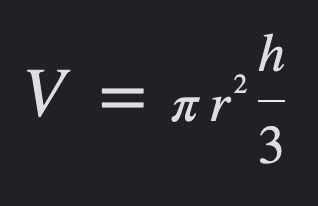
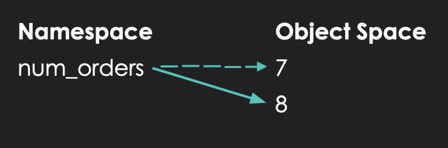
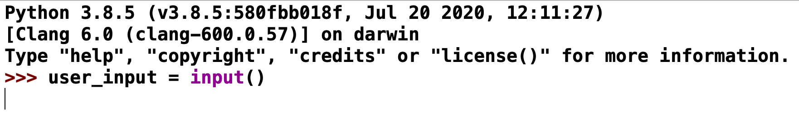
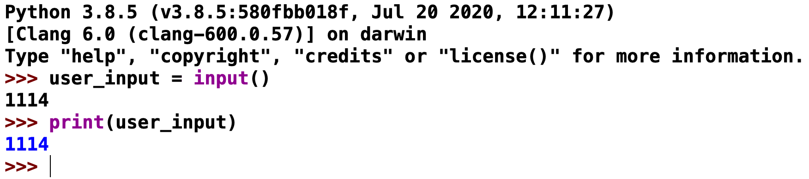
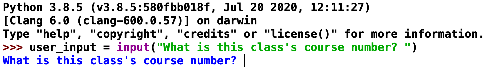
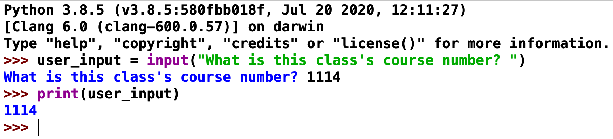
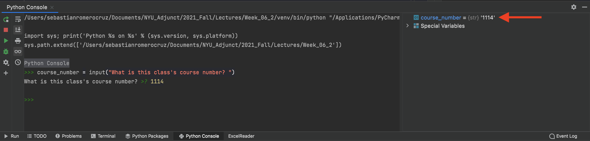

<h2 align=center>Lecture 03</h2>

<h1 align=center>Programming Fundamentals: Operators, Expressions, and Program Output</h1>

### 28 Fructidor, Year CCXXX

***Song of the day***: _[**Tonight (feat. Ezra Koenig)**](https://youtu.be/FxTCTAnTP6Q) by Phoenix (2022)._

---

### Sections

0. [**Problem Solving Exercise**](#part-0-problem-solving-exercise)
1. [**Expressions**](#part-1-expressions)
2. [**Re-Assigning Values**](#part-2-reassigning-variables)
3. [**Program Output**](#part-3-program-output)
4. [**Program Input**](#part-4-program-input)

### Part 0: _Problem Solving Exercise_

Throughout the semester, us professors have decided to throw in a couple of brain teaser problems to get you to start thinking in different ways. Programming, inherently a problem-solving field, can be approached in a myriad of different ways, and training your brain to think and solve problems from different angles will go a long way in your computer science career.

This first question comes to us from an interview for a software engineering position at [**Cisco**](https://en.wikipedia.org/wiki/Cisco):

Let's say you have a square room with no roof:

```
+————————————+
|            |  
|            |
|            |
|            |
+————————————+
```

<sub>**Figure 1**: Bird's eye view of this roof-less room.</sub>

You are also given _four metal flagpoles_. The task is to **plant the flagpoles in such a way that each flagpole is touching two walls _at the same time_**. What would be your approach?

---

There is no real "correct" solution here; what interviewers look for when they ask brain-teasing questions is your _approach to solving the problem_. For example, the most obvious solution to many of you might have been to plant each flagpole at the corner of each room. Thus, they touch two walls:

```
+————————————+
|•          •|  
|            |
|            |
|•          •|
+————————————+
```

</sub>**Figure 2**: A first solution, where the character `•` represents a flagpole. Notice that, for this to work, the space between the pole and the corner would have to be non-existent. If you want to look at this from a purist's point of view, then this is not exactly possible.</sub>

Another way of thinking about this is by realising that nowhere in the problem statement does it say that we are bound to the inside of the room—that is, we can imagine this problem from the perspective of someone standing _outside of the room_. In this case, one could also use the flagpole to pierce two walls horizontally, as such:


```
     /          \
  +—/————————————\—+
  |/              \|
  /                \  
\/|                |\/
/\|                |/\
  \                /
  |\              /|
  +—\————————————/—+
     \          /
```

</sub>**Figure 3**: An alternative solution. Physically speaking, this one makes a little more sense, actually.</sub>

Being aware of these two solutions, I bet that you can come up with others by "bending the situation" a little.

### Part 1: _Expressions_

So, last time, we left off with the idea that we can store a piece of data (e.g. a number, a word, etc.) inside Python
using variables. This allows us to keep that information safe and organized so that we can use it in our programs later.

For example, let's say we wanted to calculate the volume of a cone with a base radius of 7 and a height of 4.5. **How
would you define these variables in Python?**

Perhaps something like this:

```python
pi = 3.14156
base_radius = 7
height = 4.5
```

In order, these three variables read in English as:

- A variable called `pi` with the `float` (floating-point) value of `3.14156`
- A variable called `base_radius` with the `int` (integer) value of `7`
- A variable called `height` with the `float` value of `4.5`.

Note again that the `=` does **not** represent equality, but rather is the **assignment operator**.

This is all well and good, but the formula for the volume of a cone is as follows:



<sub>**Figure 4**: Formula for the volume of a cone, `V`, of base radius `r` and height `h`.</sub>

Clearly, there's more to calculating the volume than just defining three variables. We need to actually operate on them.
For this, in programming, we construct what is called an ***expression***.

> **Expression**: a combination of operators and operands (variables and values) that, when evaluated, results in a 
> single value.

We saw last time that Python can do simple mathematical operations—namely, add:

```python
>>> current_year = 2022
>>> university_years = 4
>>> current_year + university_years
2026
```

In this case, `current_year` and `university_years` are the **operands** of the expression, and `+` is the **operator**
of the expression (the "plus" or "addition" operator).

> **Operator**: a symbol that performs a simple computation on, or between, operands.

> **Operand**: a value on which an operator acts.

The great thing about expressions that we can save their result, whatever that result may be, inside a variable:

```python
>>> current_year = 2022
>>> university_years = 4
>>> graduation_year = current_year + university_years
```

Now, the variable `graduation_year` is **storing the value of the result of applying the `+` operator on the operands 
`current_year` and `university_years`**.

We could have simply said that `graduation_year` is "equal to `current_year` plus `university_years`", but thinking in
terms of operators and operands helps us account for the possibility of our operands _not_ being numbers. (i.e. what
happens if you add two strings together?)

---

So, how can we apply this same process to our earlier problem of calculating the volume of a cone?

```python
pi = 3.14156
base_radius = 7
height = 4.5

volume_of_cone = pi * (base_radius * base_radius) * (height / 2)  # evaluates to 346.35699
```

<sub>**Code Block 1**: Calculating the volume of a cone and storing it in the variable `volume_of_cone`.</sub>

The variable `volume_of_cone` is now holding the value of an **expression**. The difference between this and a simple
value is that the value of an expression is dependent on the values of its contents. In code block 2, `volume_of_cone`
happens to evaluate to `346.35699`, but if I changed the values of `pi`, `base_radius`, and/or `height`, the value of
`volume_of_cone` would also change:

```python
pi = 3.14156
base_radius = 20
height = 5.5

volume_of_cone = pi * (base_radius * base_radius) * (height / 2)  # evaluates this time to 3455.716
```

In this expression, `pi`, `base_radius`, and `height` are the ***operands***; `*` and `/` are the ***operators***.

Here's a table of the arithmetic operators available to us in Python:

| **Operator** | **Description**  | **Example**                                                                                              | **Notes**                                                                                                                                                                                            |
|--------------|------------------|----------------------------------------------------------------------------------------------------------|------------------------------------------------------------------------------------------------------------------------------------------------------------------------------------------------------|
| `+`          | Addition         | `2.5 + 3` (evaluates to float value `5.5`)                                                               |                                                                                                                                                                                                      |
| `-`          | Subtraction      | `42 - 6.7` (evaluates to float value `35.3`)                                                             |                                                                                                                                                                                                      |
| `*`          | Multiplication   | `0.15 * 0.045` (evaluates to float value `0.00675`)                                                      |                                                                                                                                                                                                      |
| `**`         | Exponentiation   | `25 ** 0.5` (equivalent to saying "25 to the power of 0.5; evaluates to float value `5.0`)               |                                                                                                                                                                                                      |
| `/`          | Division         | `10 / 150` (evaluates to float value `0.06666666666666667` in my computer; exact approximation may vary) | Also known as floating-point division                                                                                                                                                                |
| `//`         | Integer Division | `93.4323 // 5` (evaluates to float value `18.0`)                                                         | Evaluates to whole number resulting from removing decimal component of floating-point division result; while integer division will always result in a whole number, the type will still be a `float` |
| `%`          | Modulus          | `63 % 10` evaluates to integer value `3`; 63 divides 6 even times into 10, leaving a remainder of 3      | Evaluates to the remainder from dividing two integers; returns an `int` value                                                                                                                        |

<sub>**Figure 5**: Python's arithmetic operators.</sub>

The precedence of these operators are basically the same as the mathematical acronym P.E.M.D.A.S., except we could 
expand it to include negation (negative numbers) : P.E.N.M.D.A.S. (very catchy):

1. **P**: Parentheses `()`
2. **E**: Exponentiation `**`
3. **N**: Negation `-`
4. **M**: Modulus `*`; **D**: Division `/`; **I**: Integer division `//`; **M**: Multiplication `%`; **A**: Addition `+`; **S**: Substraction `-`

For example:

```python
>>> 5 * 3 + 2 * 7
29

>>> 5 * (3 + 2) * 7
175

>>> 7 % 3 * -5
-5

>>> 98 // 10 + 2 % 7
11
```

### Part 2: _Reassigning Variables_

You've probably guessed by now that the reason why variables are given that name is because their value can vary. That
is, a variable is not restricted to holding a single value throughout the course of a program.

Technically speaking, a variable is simply a reference to an object (an `int`, `bool`, etc.) in memory, and since memory
can be updated, the variable will always reference that same location in memory, regardless of what its value is.

For example, if we defined the following variable, and then changed its value:

```python
num_orders = 7
num_orders = num_orders + 1  # evaluates to the arithmetic expression 7 + 1, or integer value 8
```

Here, the variable `num_orders` is referencing an `int` object with the value of `7` stored in location A in memory.
When we reassign the value of `num_orders + 1` to `num_orders`, its actually the value inside location A in memory that
is changing. `num_orders` remains simply a reference to location A.

In terms of namespace and object space, this is what this process looks like:



<sub>**Figure 6**: Variable value reassignment. Note that while the object in the object space changes from `7` to `8`, it 
does not change location in memory.</sub>

<!-- ### Part 3: _Boolean Expressions_

We're pretty well acquainted with how boolean expressions function at this point. They either evaluate to `True` or they
evaluate to `False`. We also learned about some of their respective operators: `not`, `and`, and `or`. Given our 
newfound knowledge of variables, we can expand our current definition to something a little more nuanced:

> **Boolean expression**: Code that evaluates to a combination of operators and operands that, when evaluated, results 
> in `True` or `False`.

#### _Comparison Operators_

Moreover, just like in mathematics, we have the ability to compare two values to figure out their equality. These are 
called ***comparison, or relational, operators***:

| **Operator** | **Verbal Equivalent**                         | **Example**                                           |
|--------------|-----------------------------------------------|-------------------------------------------------------|
| `==`         | _"Is A equal in value to B?"_                 | `45 == 45.0` (evaluates to bool value `True`)         |
| `!=`         | _"Is A not equal in value to B?"_             | `10 != 10.0` (evaluates to bool value `False`)        |
| `>`          | _"Is A greater in value than B?"_             | `0.15 > 0.045` (evaluates to bool value `True`)       |
| `>=`         | _"Is A greater than or equal in value to B?"_ | `25 >= 25` (evaluates to bool value `True`)           |
| `<`          | _"Is A less in value than B?"_                | `10 < 150` (evaluates to bool value `True`)           |
| `<=`         | _"Is A less than or equal in value to B?"_    | `93.4323 <= 93.4324` (evaluates to bool value `True`) |

<sub>**Figure 7**: Comparison (relational) operators in Python, where both A and B are comparable values.</sub>

> **Comparable value**: Values that can be compared using a boolean operator. (E.g. `4` and `7.6` are comparable values,
> but `"lol I'm so tired."` and `True` aren't.)

#### _The `not` Operator_

We can represent the effects of the `not` operator by using a _truth table_:

| **`a`**   | **`not a`** | **Description**                                                    |
|-----------|--------------|-------------------------------------------------------------------|
| `True`    | `False`      | If **`a`** evaluates to `True`, **`not a`** evaluates to `False`  |
| `False`   | `True`       | If **`a`** evaluates to `False`, **`not a`** evaluates to `True`  |

<sub>**Figure 8**: Truth table for the `not` operator, where `a` is any given boolean expression.</sub>

To give linguistically relatable examples:

- "The year is 2022" evaluates to `True`
- `not` "NYU is in New York" evaluates to `False`

`not` is a pretty nice operator because it only involves the use of only one boolean expression (the technical term for
this is a unary boolean operator).

#### _The `and` Operator_

Oftentimes, though, we need multiple conditions to be true in order for something execute. For instance, NYU's daily 
screener probably allows you to come into the building by applying the following logic:

> ***If*** this student is vaccinated ***and*** is not experiencing any COVID-19 symptoms, they can go into any NYU 
> building.

In this case, we have **two** conditions that need to be true for a certain action to get executed. The operator used 
here would be the word "and". Conveniently, that corresponds exactly to Python's `and` operator:

| **a**   | **b**   | **a and b** | **Description**                                                                                      |
|---------|---------|-------------|------------------------------------------------------------------------------------------------------|
| `True`  | `True`  | `True`      | If **a** evaluates to `True` and **b** evaluates to `True`, then **a and b** evaluates to `True`     |
| `True`  | `False` | `False`     | If **a** evaluates to `True`, and **b** evaluates to `False`, then **a and b** evaluates to `False`  |
| `False` | `True`  | `False`     | If **a** evaluates to `False`, and **b** evaluates to `True`, then **a and b** evaluates to `False`  |
| `False` | `False` | `False`     | If **a** evaluates to `False`, and **b** evaluates to `False`, then **a and b** evaluates to `False` |

<sub>**Figure 9**: Truth table for the `and` operator, where `a` and `b` are any given boolean expressions.</sub>

Let's look at some non-programming examples:

- "The year is 2022 and NYU is in New York" evaluates to `True`
- "The year is 2018 and NYU is in New York" evaluates to `False`
- "The year is 2022 and `not` NYU is in New York" evaluates to `False`
- "The year is 2018 and NYU is in the city of York" evaluates to `False`

By the way, since `and` requires two boolean expressions to operate, it is sometimes called a _binary_ boolean operator. 

#### _The `or` Operator_

Another situation one often encounters in programming is when an instructions gets executed if either of two conditions
evaluates to true. For example, in order to attend the [**Met Gala**](https://en.wikipedia.org/wiki/Met_Gala), you 
either need to get a special invitation, or donate $30,000.00 to the museum, in order to secure your seat. This is 
different from the `and` operator because `and` requires **both** conditions to be true. In this case (as you've 
probably guessed by now) we would instead use the `or` operator.

| **a**   | **b**   | **a or b** | **Description**                                                                                       |
|---------|---------|------------|-------------------------------------------------------------------------------------------------------|
| `True`  | `True`  | `True`     | If either **a** evaluates to `True` or **b** evaluates to `True`, then **a or b** evaluates to `True` |
| `True`  | `False` | `True`     | If **a** evaluates to `True` or **b** evaluates to `False`, then **a or b** evaluates to `True`       |
| `False` | `True`  | `True`     | If **a** evaluates to `False` or **b** evaluates to `True`, then **a or b** evaluates to `True`       |
| `False` | `False` | `False`    | If **a** evaluates to `False` or **b** evaluates to `False`, then **a or b** evaluates to `False`     |

<sub>**Figure 10**: Truth table for the `or` operator, where `a` and `b` are any given boolean expressions.</sub>

This one is a little more difficult to think about, so let's look at some examples:

- "The year is 2022 or NYU is in New York" evaluates to `True`
- "The year is 2018 or NYU is in New York" evaluates to `True`
- "The year is 2022 or `not` NYU is in New York" evaluates to `True`
- "The year is 2018 or NYU is in the city of York" evaluates to `False`
- "You didn't get a special invitation to the Met Gala, or you didn't donate $30,000.00 to the Met's Anna Wintour 
Costume Center" evaluates to `False`

Essentially, the only way that the whole boolean expression can evaluate to `False` is for both of its components to be
`False`.

---

These operators also have a place in our precedence hierarchy, which is now too long to even try to make an acronym:

1. Parentheses `()`
2. Exponentiation `**`
3. Negation `-`
4. Multiplication `*`, division `/`, integer division `//`, modulus `%`
5. Addition `+`
6. Substraction `-`
7. Comparison operators (`==`, `!=`, `<=`, `>=`, `>`, `<`)
8. Not `not`
9. And `and`
10. Or `or`

For example:

```python
>>> 10 + 3 < 25 and 7 - 2 > 4
True

>>> not 10 + 5 < 7 and 5 == 4 or 7 * 3 != 5
True
```

If we break down that second one, step-by-step and following the precedence rules, it simplifies as follows:

```python
# multiplication and addition have the highest precedence, so it goes first
>>> not 10 + 5 < 7 and 5 == 4 or 7 * 3 != 5
True

# <, ==, and != have the 2nd highest precedence
>>> not 15 < 7 and 5 == 4 or 21 != 5
True

# "not" has the 3rd highest precedence
>>> not False and False or True
True

# "and" has the 4th highest precedence
>>> True and False or True
True

# "or" has the 5th and lowest precedence, so it goes last
>>> False or True
True
```

As you can see, as long as we follow these rules, we can slowly and carefully evaluate any expression, regardless of
how long and complex it may be. -->

### Part 3: _Program Output_

Recall our program for calculating the volume of a cone:

```python
pi = 3.14156
base_radius = 7
height = 4.5

volume_of_cone = pi * (base_radius * base_radius) * (height / 2)  # evaluates to 346.35699
```

In order to let you know that the result of this operation was `346.35699`, I had to write a comment saying so next
to the line declaring the value of `volume_of_cone`. It probably goes without saying that this is not an effective way
of _displaying_ the results of programming outputs. The code used in your phone's calculator or called ID screen most
definitely has comments scattered through it, but you have and will never see them. Instead, your phone has ***output***
protocols that display the relevant information to the user on the screen. This same principle goes for music. Audio
output is processed by signal processing programs so that it comes out as music. How would comments even begin to help 
us in this case?

We're a few ways away from worrying about those kinds of things, but for the time being, we should learn at least the
most rudimentary way of displaying data in our programs. For this, we use the built-in Python function **`print()`**:

Open up the file [**volume_of_cone.py**](volume_of_cone.py). Our program looks like this:

```python
pi = 3.14156
base_radius = 7
height = 4.5

volume_of_cone = pi * (base_radius * base_radius) * (height / 2)

print(volume_of_cone)
```
<sub>**Code Block 2**: Contents of [**volume_of_cone.py**](volume_of_cone.py).</sub>

When we press "run", our Terminal window appears and should look something like this:

```text
346.35699
```

This is how we're going to check and display the values of the expressions that we will be using throughout this class.

The `print()` function is actually extremely versatile and powerful. More on that later, but for now, burn the following
absolute fact into your brain:

> ***`print()` statements are your best friends. Use them.***

### Part 4: _Program Input_

In Monday's class we learned that we can display the values of variables and expressions by means of the `print()`
function:

```python3
lecture_id = 8
print(lecture_id)

message = "オマエはもう死んでいる。"
print(message)

obvious_fact = 5 != "5"
print(obvious_fact)
```
Output:
```text
8
オマエはもう死んでいる。
True
```

That's a great thing to be able to do, and we'll be making ample use of this faculty. However, what kind of programs
would we realistically be writing if we weren't able to interact with our user? After all, almost every program that
is useful to us in some way gets our input; your phone registers your touch as an input, your laptop registers every
key stroke as an input, a camera registers light as input. Input, input, input.

It stands to reason, then, that this should be the next thing we need to focus on.

The most basic form of user interaction in Python is done through a very succinctly named built-in function—`input()`.

At its most basic level, it functions as follows:

```python
user_input = input()

print(user_input)
```

If we run this program, you will see that our shell window will pause, and wait for an action from us:



_**Figure 7**: Our shell prompting us for input._

If we type something in—say, the course number for this class—and press "enter", you will see the following behavior:



_**Figure 8**: Our shell displaying our input._

This works just fine. But typically speaking, we want our programs to be as intuitive and user-friendly as possible—to
have good [**UI**](https://en.wikipedia.org/wiki/User_interface) and 
[**UX**](https://en.wikipedia.org/wiki/User_experience), in other words. The `input()` function allows us to give the 
user a "prompt" message by putting it, ***in string form***, inside the `input()` function's parentheses:

```python
course_number = input("What is this class's course number? ")

print(course_number)
```

If we ran this, our shell would prompt us the following way:



_**Figure 9**: Our shell prompting us for this class's course number._

Once we enter our desired input and press the "enter" key, we will see the following:



_**Figure 10**: Our shell displaying this class's course number._

These two programs, effectively, do the same exact thing (i.e. accepting user input and displaying), but in the first
one, we are barely even aware that we're being prompted for input—and we have no idea what input is supposed to even
_be_. The second example, by contrast, at the very least gives us a clear idea of the type and nature of our input.
It won't stop any user from entering the wrong thing, but at least we can say that we gave them some hints.

Now, interestingly, **Python saves all input in `str` form**, meaning that our input of "1114" is not saved as an 
integer, as one might expect, but as a string. Sure enough, if we run the same code on our console, we can very clearly
see that the variable `course_number` is a `str` object:



_**Figure 11**: PyCharm's console displaying the type of `course_number` on the right._

There is essentially no way of changing this behavior. Python, by design, received all input in string form. It's up to
us, the programmers, to parse that input into a usable form.