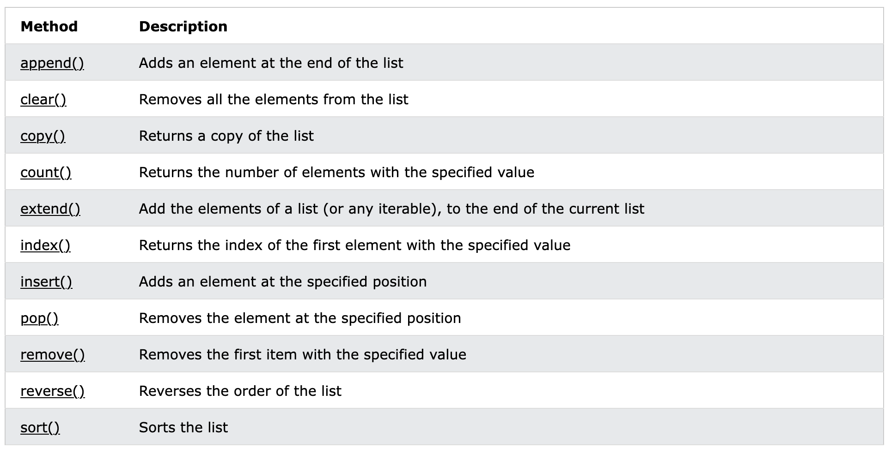

## Lecture 17

# More On Lists

### 10 Germinal, Year CCXXX

***Song of the day:*** _[**Carnival Kerfuffle**](https://youtu.be/XORwfYUH23Y) by Kristofer Maddigan (2017)._

---

### Part 0: _List Methods_

Here's a list of list methods that you'll want to be aware of in this class



<sub>**Figure 1**: List methods ([**source**](https://www.w3schools.com/python/python_ref_list.asp)). </sub>

### Part 1: _Copying Lists and Memory Maps_

Let's say we have the following list:

```python
grades_original = [87.0, 56.0, 100.0]
```

Sometimes, when we want to operate on objects, but want to keep a copy of the original intact, we create a separate 
variable and save the original contents. Let's do that:

```python
grades_original = [87.0, 56.0, 100.0]
grades_copied = grades_original

print(grades_original, grades_copied, sep='\n')
```

Output:

```commandline
[87.0, 56.0, 100.0]
[87.0, 56.0, 100.0]
```

Ok, looks like they're equal. So let's start operating on the original list. Say, let's turn them into percentages 
instead of whole grades:

```python
for index in range(len(grades_copied)):
    grades_copied[index] = grades_copied[index] / 100.0

print(grades_original, grades_copied, sep='\n')
```

<sub>**NOTE**: When I want to edit list elements using a loop, I **have** to use indexing, since sequencing creates a
loop variable, and is not using the actual value inside the list.</sub>


```text
[0.87, 0.56, 1.0]
[0.87, 0.56, 1.0]
```

Uh-oh. What happened here? Without knowing anything about it, it looks like our program **edited our original list as
well, even though we didn't ask it to**. Why?

This is a memory related-issue, actually. Since lists can hold a lot of potentially very large elements, Python avoids
a memory overflow by creating a ***reference*** to the same list every time we create another variable using that list
as a value.

You can think of the memory map of this as looking as this:

```commandline
 |----------------------- MEMORY LOCATION A  -----------------------------------------|
 |                                                                                    |
 | [87.0, 56.0, 100.0]                                                                |
 |  ^                                                                                 |
 |  |                                                                                 |
 |  |--- < grades_original  # if you edit this list, grades_copied will also change   |
 |  |                                                                                 |
 |  |--- < grades_copied    # if you edit this list, grades_original will also change |
 |                                                                                    |
 |------------------------------------------------------------------------------------|
```

<sub>**Figure 2**: Both variables `grades_original` and `grades_copied` are not holding lists of the same value, they
are actually hold **the same exact list**.</sub>

So what do we do if we really want to create a completely separate list that happens to have the same elements as our
original list? We use the list method we're learning, `copy()`:

```python
grades_original = [87.0, 56.0, 100.0]
grades_copied = grades_original
grades_separate = grades_copied.copy()

# Editing grades_separate
for index in range(len(grades_copied)):
    grades_copied[index] = grades_copied[index] / 100.0

print("{}: {}".format("Original grades", grades_original))
print("{}: {}".format("Memory copy of grades", grades_copied))
print("{}: {}".format("Separate copy of grades", grades_separate))
```

Output:

```commandline
Original grades: [0.87, 0.56, 1.0]
Memory copy of grades: [0.87, 0.56, 1.0]
Separate copy of grades: [87.0, 56.0, 100.0]
```

In this case, our memory model will look like this:

```commandline
 |----------------------- MEMORY LOCATION A  -----------------------------------------|
 |                                                                                    |
 | [87.0, 56.0, 100.0]                                                                |
 |  ^                                                                                 |
 |  |                                                                                 |
 |  |--- < grades_original  # if you edit this list, grades_copied will also change   |
 |  |                                                                                 |
 |  |--- < grades_copied    # if you edit this list, grades_original will also change |
 |                                                                                    |
 |------------------------------------------------------------------------------------|
 
 |----------------------- MEMORY LOCATION B  -----------------------------------------|
 |                                                                                    |
 | [87.0, 56.0, 100.0]                                                                |
 |  ^                                                                                 |
 |  |                                                                                 |
 |  |--- < grades_separate                                                            |
 |                                                                                    |
 |------------------------------------------------------------------------------------|
```

<sub>**Figure 3**: While variables `grades_original` and `grades_copied` are actually holding the same exact list,
`grades_separate` exists completely separate in memory. It just _happens_ to have the same member values as the other
two.</sub>

This happens with any container type that is **mutable**, by the way. So far, we only know lists, but later in the 
semester we will be looking at one more.

---

Another aspect of memory we need to keep in mind is the curious case of nested lists. Let's say we have, again, a list
of grades, but this time, we have the grades of the entire class. For simplicity, let's assume that the class only has
three students:

```python
class_grades_original = [[87.0, 56.0, 100.0], [70.0, 95.0, 90.5], [80.0, 85.0, 89.0]]
```

When it comes to nested mutable objects, Python actually creates individual spots in memory for each of them. So our
memory model would look like this:

```commandline
 |----------------------- MEMORY LOCATION A  -----------------------------------------|
 |                                                                                    |
 | [MEM_LOC_X, MEM_LOC_Y, MEM_LOC_Z]                                                  |
 |  ^                                                                                 |
 |  |                                                                                 |
 |  |--- < class_grades_original                                                      |
 |                                                                                    |
 |------------------------------------------------------------------------------------|
 
========================================================================================================================
 
 |----------------------- MEMORY LOCATION X  -----------------------------------------|
 |                                                                                    |
 | [87.0, 56.0, 100.0]                                                                |
 |  ^                                                                                 |
 |  |                                                                                 |
 |  |--- < MEM_LOC_X                                                                  |
 |                                                                                    |
 |------------------------------------------------------------------------------------|
 |----------------------- MEMORY LOCATION Y  -----------------------------------------|
 |                                                                                    |
 | [70.0, 95.0, 90.5]                                                                 |
 |  ^                                                                                 |
 |  |                                                                                 |
 |  |--- < MEM_LOC_Y                                                                  |
 |                                                                                    |
 |------------------------------------------------------------------------------------|
 |----------------------- MEMORY LOCATION Z  -----------------------------------------|
 |                                                                                    |
 | [80.0, 85.0, 89.0]                                                                 |
 |  ^                                                                                 |
 |  |                                                                                 |
 |  |--- < MEM_LOC_Z                                                                  |
 |                                                                                    |
 |------------------------------------------------------------------------------------|
```

<sub>**Figure 4**: Memory model of our list of lists `class_grades_original`.</sub>

So what happens when we make a copy using the `copy()` list method?

```python
class_grades_original = [[87.0, 56.0, 100.0], [70.0, 95.0, 90.5], [80.0, 85.0, 89.0]]
class_grades_separate = class_grades_original.copy()
```

```commandline
 |----------------------- MEMORY LOCATION A  -----------------------------------------|
 |                                                                                    |
 | [MEM_LOC_X, MEM_LOC_Y, MEM_LOC_Z]                                                  |
 |  ^                                                                                 |
 |  |                                                                                 |
 |  |--- < class_grades_original                                                      |
 |                                                                                    |
 |------------------------------------------------------------------------------------|
 |----------------------- MEMORY LOCATION B  -----------------------------------------|
 |                                                                                    |
 | [MEM_LOC_X, MEM_LOC_Y, MEM_LOC_Z]                                                  |
 |  ^                                                                                 |
 |  |                                                                                 |
 |  |--- < class_grades_separate                                                      |
 |                                                                                    |
 |------------------------------------------------------------------------------------|
 
========================================================================================================================
 
 |----------------------- MEMORY LOCATION X  -----------------------------------------|
 |                                                                                    |
 | [87.0, 56.0, 100.0]                                                                |
 |  ^                                                                                 |
 |  |                                                                                 |
 |  |--- < MEM_LOC_X                                                                  |
 |                                                                                    |
 |------------------------------------------------------------------------------------|
 |----------------------- MEMORY LOCATION Y  -----------------------------------------|
 |                                                                                    |
 | [70.0, 95.0, 90.5]                                                                 |
 |  ^                                                                                 |
 |  |                                                                                 |
 |  |--- < MEM_LOC_Y                                                                  |
 |                                                                                    |
 |------------------------------------------------------------------------------------|
 |----------------------- MEMORY LOCATION Z  -----------------------------------------|
 |                                                                                    |
 | [80.0, 85.0, 89.0]                                                                 |
 |  ^                                                                                 |
 |  |                                                                                 |
 |  |--- < MEM_LOC_Z                                                                  |
 |                                                                                    |
 |------------------------------------------------------------------------------------|
```

<sub>**Figure 5**: Memory model of our lists of lists `class_grades_original` and `class_grades_separate`.</sub>

Do you see why this might cause unexpected behaviour? Let's say that the student in index `2` retook the final, and got
a `100.0`.

```python
FINAL_IDX = 2

class_grades_original = [[87.0, 56.0, 100.0], [70.0, 95.0, 90.5], [80.0, 85.0, 89.0]]
class_grades_separate = class_grades_original.copy()

class_grades_separate[2][FINAL_IDX] = 100.0

print(class_grades_original, class_grades_separate, sep='\n')
```

Output:

```commandline
[[87.0, 56.0, 100.0], [70.0, 95.0, 90.5], [80.0, 85.0, 100.0]]
[[87.0, 56.0, 100.0], [70.0, 95.0, 90.5], [80.0, 85.0, 100.0]]
```

If we made a completely separate list of grades lists, why did the original also change? The answer is that, while 
`copy()` makes a completely separate copy of the **outer** list, the ***inner lists retain their old locations in 
memory.***

Fixing this can get _really_ messy, really fast, and requires concepts that are only taught after this class (namely,
recursion). The good news is that you don't have to fix it yourself! Python has a module that does this job for us 
(because of course it does): `copy`. The method you'll want to use is called `deepcopy()`:

```python
import copy

FINAL_IDX = 2

class_grades_original = [[87.0, 56.0, 100.0], [70.0, 95.0, 90.5], [80.0, 85.0, 89.0]]
class_grades_deepcopy = copy.deepcopy(class_grades_original)

class_grades_deepcopy[2][FINAL_IDX] = 100.0

print(class_grades_original, class_grades_deepcopy, sep='\n')
```

Output:

```commandline
[[87.0, 56.0, 100.0], [70.0, 95.0, 90.5], [80.0, 85.0, 89.0]]
[[87.0, 56.0, 100.0], [70.0, 95.0, 90.5], [80.0, 85.0, 100.0]]
```

```commandline
 |----------------------- MEMORY LOCATION A  -----------------------------------------|
 |                                                                                    |
 | [MEM_LOC_X, MEM_LOC_Y, MEM_LOC_Z]                                                  |
 |  ^                                                                                 |
 |  |                                                                                 |
 |  |--- < class_grades_original                                                      |
 |                                                                                    |
 |------------------------------------------------------------------------------------|
 |----------------------- MEMORY LOCATION B  -----------------------------------------|
 |                                                                                    |
 | [MEM_LOC_R, MEM_LOC_S, MEM_LOC_T]                                                  |
 |  ^                                                                                 |
 |  |                                                                                 |
 |  |--- < class_grades_deepcopy                                                      |
 |                                                                                    |
 |------------------------------------------------------------------------------------|
 
 =======================================================================================================================
 
 |----------------------- MEMORY LOCATION R  -----------------------------------------|
 |                                                                                    |
 | [87.0, 56.0, 100.0]                                                                |
 |  ^                                                                                 |
 |  |                                                                                 |
 |  |--- < MEM_LOC_R                                                                  |
 |                                                                                    |
 |------------------------------------------------------------------------------------|
 |----------------------- MEMORY LOCATION S  -----------------------------------------|
 |                                                                                    |
 | [70.0, 95.0, 90.5]                                                                 |
 |  ^                                                                                 |
 |  |                                                                                 |
 |  |--- < MEM_LOC_S                                                                  |
 |                                                                                    |
 |------------------------------------------------------------------------------------|
 |----------------------- MEMORY LOCATION T  -----------------------------------------|
 |                                                                                    |
 | [80.0, 85.0, 89.0]                                                                 |
 |  ^                                                                                 |
 |  |                                                                                 |
 |  |--- < MEM_LOC_T                                                                  |
 |                                                                                    |
 |------------------------------------------------------------------------------------|

========================================================================================================================
 
 |----------------------- MEMORY LOCATION X  -----------------------------------------|
 |                                                                                    |
 | [87.0, 56.0, 100.0]                                                                |
 |  ^                                                                                 |
 |  |                                                                                 |
 |  |--- < MEM_LOC_X                                                                  |
 |                                                                                    |
 |------------------------------------------------------------------------------------|
 |----------------------- MEMORY LOCATION Y  -----------------------------------------|
 |                                                                                    |
 | [70.0, 95.0, 90.5]                                                                 |
 |  ^                                                                                 |
 |  |                                                                                 |
 |  |--- < MEM_LOC_Y                                                                  |
 |                                                                                    |
 |------------------------------------------------------------------------------------|
 |----------------------- MEMORY LOCATION Z  -----------------------------------------|
 |                                                                                    |
 | [80.0, 85.0, 100.0]                                                                |
 |  ^                                                                                 |
 |  |                                                                                 |
 |  |--- < MEM_LOC_Z                                                                  |
 |                                                                                    |
 |------------------------------------------------------------------------------------|
```

<sub>**Figure 6**: Memory model of our lists of list `class_grades_original`, and its deep copy 
`class_grades_separate`.</sub>

The technical terms for these two types of copies from **figure 4** and **figure 5** are "shallow" and "deep" copy:

> **Shallow Copy**: Constructing a new collection object and then populating it with references to the nested objects 
> found in the original.

> **Deep Copy**: Constructing a new collection object and then recursively populating it with copies of the nested 
> objects found in the original.

That's all there is to it. Just be aware that if you are going to create a copy of a mutable container, such as a list,
you should be using the `copy.deepcopy()` method.

### Part 2: _Tuples_

Today we're going to introduce a topic that, at first glance, will look awfully familiar. Another important way to store
data in Python is by way of a tuple. A tuple looks as follows:

```python
dubrovnik = ("Croatia", "Dubrovnik-Neretva", 21.35, 3, "UTC+1", "Saint Blaise")
print(dubrovnik)
```
Output:
```text
('Croatia', 'Dubrovnik-Neretva', 21.35, 3, 'UTC+1', 'Saint Blaise')
```

So far, it basically just looks like a list. We can even index it and iterate through it as if it were a list:

```python
for element in dubrovnik:
    print(element)

for index in range(len(dubrovnik)):
    print("Element #{}: {}".format(index, dubrovnik[index]))
```

Output:

```text
Croatia
Dubrovnik-Neretva
21.35
3
UTC+1
Saint Blaise
Element #0: Croatia
Element #1: Dubrovnik-Neretva
Element #2: 21.35
Element #3: 3
Element #4: UTC+1
Element #5: Saint Blaise
```

So why the need for tuples at all? Their main difference (from where all of its other differences derive from) is that
**tuples are immutable**:

```python
azuna = ("Ayumu", "Setsuna", "Shizuku")
azuna[0] = "Shioriko"
```
Output:
```commandline
Traceback (most recent call last):
  File "<input>", line 1, in <module>
TypeError: 'tuple' object does not support item assignment
```

That error's last line tells us all we need to know. Naturally, then, the list of tuple methods is much shorter thant
the list object's:


<sub>**Figure 7**: PyCharm suggesting tuple attributes and methods. We basically only have `index()` and `count()` 
available for free use. </sub>

While tuple may seem restrictive and almost useless given the flexibility of lists, their ability to hold data and 
guarantee its immutability is an extremely helpful power to have in computer science. Examples include, let's say, a
city's coordinates or a list of 1114 professors in the fall of 2021:

```python
kyoto_coordinates = (35.0116, 135.7681)
professors = ("Katz", "Romero Cruz")
```

We know that neither of these values will **ever** change throughout the duration of our program (at least, I sure 
*hope* they don't). So the ability to store them in an immutable collection acts as a safeguard from your program or 
teammmate accidentally editing it by mistake.

One last super cool we can do with tuples is that they allow us to define multiple values at once:

```python
power, wisdom, courage = ("Din", "Nayru", "Farore")

print("{}, Goddess of Power".format(power))
print("{}, Goddess of Wisdom".format(wisdom))
print("{}, Goddess of Courage".format(courage))
```

Output:

```text
Din, Goddess of Power
Nayru, Goddess of Wisdom
Farore, Goddess of Courage
```

### Part 3: _Lists and Strings_

We've already kind of seen that strings and lists are very similar. They're both iterable, indexable collections of 
objects. So it may strike you that there must be, at least in Python, some sort of special connection that they should 
have. For example, it would be super useful to convert the string containing a full name into a list containing the 
first name and the last name as individual elements:

```python
full_name = "Janko Nilovic"
# some operation
print(full_name)
```
Desired output:
```text
['Janko', 'Nilovic']
```

Of course, since I am mentioning it, it means that it does exist. In this case, the operation we're talking about is the
`split()` string method:

```python
full_name = "Janko Nilovic"
full_name = full_name.split(' ')
print(full_name)
```
Output:

```text
['Janko', 'Nilovic']
```

What is happening is this:

1. The string value `"Janko Nilovic"` is being stored in the variable `full_name`.
2. The string variable `full_name` evokes its `split()` method, passing `' '` as an argument. This parameter is called
the **delimiter**, and it tells the `split()` method the character it would like the split the string by.
3. The variable `full_name` is reassigned a new list value, containing the components of its former string value as 
elements.

Here are more examples:

```python
>>> team = "Ann, Makoto, Haru, Kasumi"
>>> team.split(", ")
['Ann', 'Makoto', 'Haru', 'Kasumi']

>>> french_governments = "Kingdom of France -> 1st French Republic -> 1st French Empire -> Kingdom of the French -> 2nd French Republic -> 2nd French Empire -> 3rd French Republic -> French State -> 4th French Republic -> 5th French Republic"
>>> french_governments.split(" -> ")
['Kingdom of France', '1st French Republic', '1st French Empire', 'Kingdom of the French', '2nd French Republic', '2nd French Empire', '3rd French Republic', 'French State', '4th French Republic', '5th French Republic']

>>> numbers = "1 2 3 4 5 6 7 8 9 0"
>>> numbers.split('a')
['1 2 3 4 5 6 7 8 9 0']
```

So, if we can go in this direction, it stands to reason that we should be able to convert lists into strings. The way
we do this is by the **`join()` string method**:

```python
>>> versions = ["Seasons", "Ages"]
>>> "/".join(versions)
'Seasons/Ages'

>>> " = ".join(["3 + 4", "7"])
'3 + 4 = 7'

>>> " ".join(["オマエ", "は", "もう", "死んでいる"])
'オマエ は もう 死んでいる'
```

Notice that, while both `split()` and `join()` are string methods, the former is called on the string that you want to 
make into a list, while the latter is called on the string that will separate the various strings in your list. It may
be helpful to create variables that will help you remember this:

```python
words = ["Document", "Programming", "Personal Projects", "Fall 2021"]
separator = " > "

folder_structure = separator.join(words)  # "join these words with this separator"
print(folder_structure)
```

Output:

```text
Document > Programming > Personal Projects > Fall 2021
```

One other cute and useful thing you can do is convert a string into a list of each of its characters:

```python
>>> band_name = "The Natsuyasumi Band"
>>> list(band_name)
['T', 'h', 'e', ' ', 'N', 'a', 't', 's', 'u', 'y', 'a', 's', 'u', 'm', 'i', ' ', 'B', 'a', 'n', 'd']