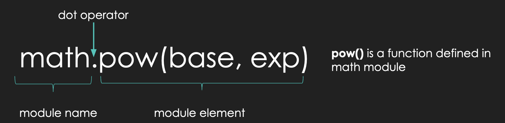
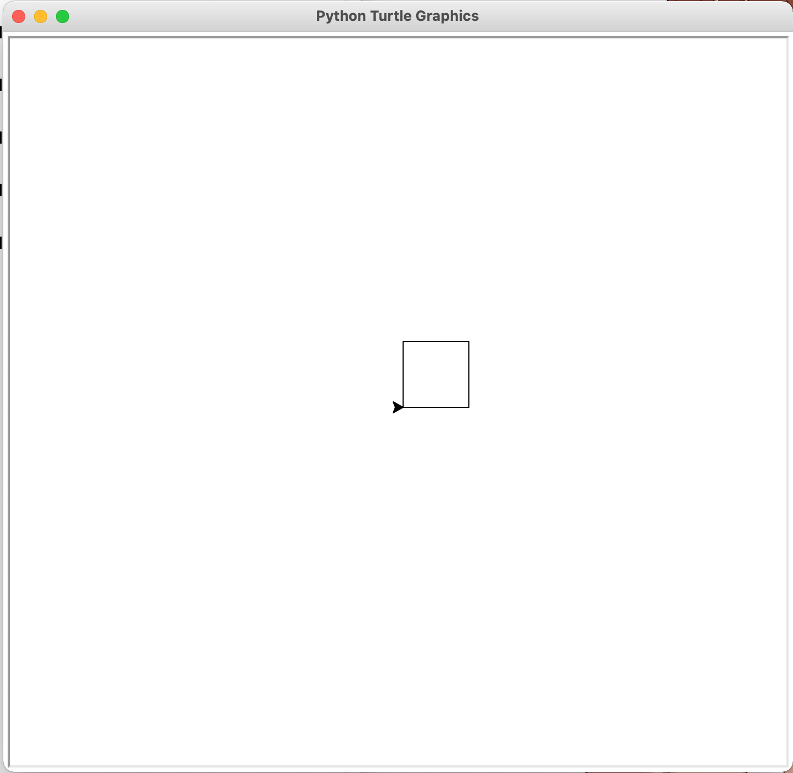
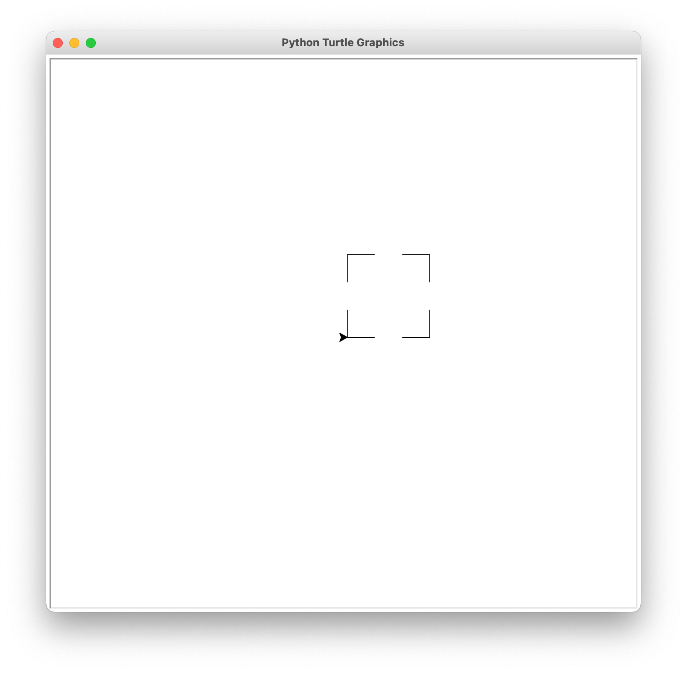

## Lecture 05

# Python Modules

### 19 Pluviôse, Year CCXXX

***Song of the day***: _[**I Feel Your Love**](https://youtu.be/1x50e46vO9c) by 이루리 Luli lee (2021)._

### Part 0: _Review_

Let's start with a quick review problem. Let's pretend we have two classroom sizes: one that fits 35 students and one 
that fits 15. Write a program that does the following:

1. Ask the user how large the student body is (i.e. how many students there are).
2. Determine how many 35-student classrooms we can form with this many students.
3. Determine how many 15-student classrooms we can form with the remaining students.
4. Display the results of steps 2 and 3, along with how many students remain leftover.

Number 1 is an easy one; we use the `input()` and `int()` functions. I'm also going to define two variables to store the
sizes of our classrooms, so that I can keep track of them and change them at any point if I so wish:

```python
class_size_a = 35
class_size_b = 15

num_of_students = int(input("How large is the student body? "))
```

Now, for step 2, I'm going to use the same technique we used when we wanted to see how many quarters we could form with
a specific amount of pennies. This time, though, it's not pennies but students, and it's not 25-cent groups, but 
35-student groups. For this, we use the `//` operator:

```python
num_size_a = num_of_students // class_size_a
```

How can we determine how many students remain after this operation? The `%` operator, which gives us the remainder after
a division, should do the trick:

```python
num_of_students = num_of_students % class_size_a
```

Using this amount of remaining students, we can see how many 15-student classrooms we can form by literally repeating 
the same process using `class_size_b` instead of `class_size_a`:

```python
num_size_b = num_of_students // class_size_b
num_of_students = num_of_students % class_size_b  # this is the number of leftover students
```

Finally, step 3 just requires a quick `print()` statement:

```python
print("We formed " + str(num_size_a) + " 35-student classroom(s), " + str(num_size_b) +
      " 15-student classrooms, and have " + str(num_of_students) + " leftover students.")
```

[**Here's**](student_body.py) the full solution.

### Part 1: _The `math` Module_

You know how, in a previous lecture, I asked you to calculate the volume of a cone? For many mathematical operations, we
need to use certain, pre-defined constants, such as **pi**. In our case, I asked you to define a variable that would 
hold your best estimation of this value:

```python
pi = 3.14156  # for example
```

It might not come as too much of a surprise that approximating such common and important constants is very bad practice.
This is especially the case because programming is often used in engineering applications where precision is of
paramount importance. In other words, you are not going to tell your boss and NASA that you programmed a rover by "sort
of guessing the value of pi." The great thing is that you really don't have to at all!

One of the great things about Python is that it has a ***huge*** community that constantly releases their code to the 
public—free of charge—for us to use. When we want to make use of this code, we have to import it in the form of a 
***module***.

---

One of the most common modules is the `math` module which, as you can probably guess, contains a plethora of math 
related functions and values that we can use:

```python
import math

pi = math.pi
e = math.e

print(pi)
print(e)
print(math.sin(pi))  # prints the sine of pi
print(math.sqrt(e))  # prints the square-root of e
print((math.pow(pi, e)))  # prints pi ** e
print(math.radians(pi))  # prints the radian equivalent of pi degrees
print(math.floor(e))  # rounds e up
print(math.ceil(e))  # rounds e down
```

Output:

```text
3.141592653589793
2.718281828459045
1.2246467991473532e-16
1.6487212707001282
22.45915771836104
0.05483113556160755
2
3
```

As you can see, we need to explicitly import the module for Python to be able to use it (`import math`). Note the format
of module function calls:



<sub>**Figure 1**: The format of a function call from the `math` module.</sub>

So, if we were to calculate the volume of our cone again—properly this time—I would now do something like 
[**this**](volume_of_cone.py):

```python
import math

base_radius = float(input("Please enter the length of the cone base radius: "))
cone_height = float(input("Please enter the length of the cone height: "))

constants = math.pi / 3
variables = math.pow(base_radius, 2) * cone_height  # the use of math.pow() is not strictly necessary, but I'm proving a point

volume = constants * variables

print("The volume of this cone is " + str(volume) + ".")
```

Notice here that, when I used `math.pi`, I did not follow it with a set of parentheses `()`. This is because **`pi` is
not a function** (like `print()`, `input()`, etc.), but rather a simple value. On the other hand, we can see that the
`math.pow()` function call makes use of parentheses. This is because all Python function calls require the use of 
parentheses. We will learn more about the specific of functions after the first midterm, but for now, you can safely 
assume that this is always the case.

According to the `math` module documentation, inside `math.pow()`'s parentheses, you must put the value of the base that
you want to raise, and the power to which you want to raise it, in that order:


<sub>**Figure 2**: `math.pow()`'s documentation, explaining its use and its difference from the built-in `**` 
operator.</sub>

Here's the entire [**documentation**](https://docs.python.org/3/library/math.html) for the `math` module for your 
reference.

### Part 2: _The `random` Module_

Another very common module is the `random` module. It basically is what it sounds: a library of functions that deal with
(pseudo-)random behavior.

The most basic of these is the `random()` function, which always returns a pseudo-randomly generated decimal `float` 
value:

```python
import random

random_decimal = random.random()
print(random_decimal)

random_decimal = random.random()
print(random_decimal)

random_decimal = random.random()
print(random_decimal)

random_decimal = random.random()
print(random_decimal)
```

A possible output:

```text
0.6549562234417277
0.8773055016457298
0.6249540159645146
0.5591596841328375
```

How would this be useful? The most basic example I can think of is a [**coin-flip program**](coin_flip.py), where `1` is
heads and `0` is tails:

```python
import random

random_decimal = random.random()
result = round(random_decimal)

print("The result of this coin flip is: " + str(result))
```

A possible output—it has roughly a 50-50 chance of being either a `1` or a `0`:

```text
1
```

<sub>**Note**: The `round()` function simply rounds a number to its closest integer value.</sub>

If you would like to instead generate random integers, we could make use of the `randrange()` function:

```python
import random

lowest_possible = 1
upper_limit = 10

random_integer = random.randrange(lowest_possible, upper_limit)

print(random_integer)
```

A possible output:

```text
8
```

The `randrange()` function takes two arguments (i.e. values inside the parentheses). The first value represents the 
lowest possible integer that can be returned. The second value marks the upper limit—this means all possible numbers
***below*** this value are possible. In other words, the upper limit is **non-inclusive**. This being the case, our code
above can produce any integer value between 1 and 9.

If this "limitation" sounds weird to you, don't worry—it _is_ weird. In fact, there's actually another function in the
`random` module, `randint()`, where both values are inclusive. The reasons for `randrange()` will become obvious a bit
later in the semester, but when it comes to this module, feel free to use [either or both](random_integers.py) unless 
instructed otherwise:

```python
import random

lower_limit = 1
upper_limit = 10

random_integer_a = random.randrange(lower_limit, upper_limit)
random_integer_b = random.randint(lower_limit, upper_limit)

print("A random number from", lower_limit, "(inclusive) and", upper_limit, "(exclusive):", random_integer_a)
print("A random number from", lower_limit, "(inclusive) and", upper_limit, "(inclusive):", random_integer_b)
```

Possible output:

```text
A random number from 1 (inclusive) and 10 (exclusive): 3
A random number from 1 (inclusive) and 10 (inclusive): 10
```

For now, these are the functions from the `random()` module that you will be using the most, but we will be getting into
others later in the semester.

Here's the `random` module's [**documentation**](https://docs.python.org/3/library/random.html) for your reference.

### Part 3: _The `turtle` Module_

Ah, `turtle`.

According to its official documentation...

> `turtle` graphics is a popular way for introducing programming to kids.
> 
> Imagine a robotic turtle starting at (0, 0) in the x-y plane. After an `import turtle`, give it the command 
> `turtle.forward(15)`, and it moves (on-screen!) `15` pixels in the direction it is facing, drawing a line as it moves.
> Give it the command `turtle.right(25)`, and it rotates in-place 25 degrees clockwise.

That's basically all there is to it (at least, as far as this class is concerned). Let's try a simple program to build a
[**square**](turtle_square.py):

```python
import random
import turtle

# Generating a random side-length using the random module
inner_angle = 90
lower_limit = 25
upper_limit = 100
random_side_length = random.randrange(lower_limit, upper_limit)

# Draw the first side and turn 90 degrees
turtle.forward(random_side_length)
turtle.left(inner_angle)

# Draw the next three sides, turning 90 degrees at each edge
turtle.forward(random_side_length)
turtle.left(inner_angle)

turtle.forward(random_side_length)
turtle.left(inner_angle)

turtle.forward(random_side_length)
turtle.left(inner_angle)
```

Once we run this program, _a third IDLE window should pop-up_ and show you this square being drawn in a cute little 
animation.



<sub>**Figure 3**: A square drawn by using simple `turtle` commands. Notice that `turtle` begins facing east, always. 
Great screenshot, I know.</sub>

Another useful set of commands are `penup()` and `pendown()`. This will allow you to move `turtle` around without 
actually drawing anything. You can get pretty creative with this, but here's a 
[**basic example**](turtle_skip_square.py) utilising our previous square:

```python
import turtle

side_length = 100
gap_constant = 3
inner_angle = 90

# Draw a third of the first side
turtle.forward(side_length / gap_constant)

# Skip over the second third
turtle.penup()
turtle.forward(side_length / gap_constant)

# Draw the last third of the side, and turn left 90 degrees
turtle.pendown()
turtle.forward(side_length / gap_constant)
turtle.left(inner_angle)

# Draw the next three sides in the same fashion, turning 90 degrees at each edge
turtle.forward(side_length / gap_constant)
turtle.penup()
turtle.forward(side_length / gap_constant)
turtle.pendown()
turtle.forward(side_length / gap_constant)
turtle.left(inner_angle)

turtle.forward(side_length / gap_constant)
turtle.penup()
turtle.forward(side_length / gap_constant)
turtle.pendown()
turtle.forward(side_length / gap_constant)
turtle.left(inner_angle)

turtle.forward(side_length / gap_constant)
turtle.penup()
turtle.forward(side_length / gap_constant)
turtle.pendown()
turtle.forward(side_length / gap_constant)
turtle.left(inner_angle)
```

Output:



<sub>**Figure 4**: Utilising `penup()` and `pendown()` for a dotted effect.</sub>

Now, before you ask me if we've evolved from a fancy calculator to a very inefficient MS Paint, we do intend on asking
relatively more complicated programs using `turtle`. You have lab to look forward to for that.