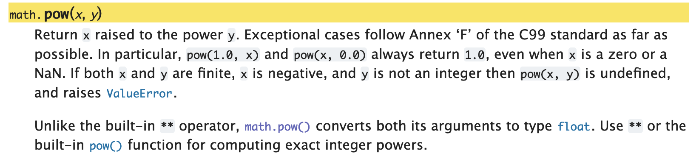

<h2 align=center>Lecture 05</h2>

<h1 align=center>Python Modules</h1>

### 5 Jour Des Récompenses, Year CCXXX

***Song of the day***: _[**A Song For You**](https://youtu.be/91K2jpmwj9o) by Donny Hathaway (1971)._

### Sections

1. [The `math` Module](#part-1-the-math-module)
2. [The `random` Module](#part-2-the-random-module)
3. [Boolean Expressions](#part-3-boolean-expressions)

### Part 1: _The `math` Module_

You know how, in a previous lecture, I asked you to calculate the volume of a cone? For many mathematical operations, we
need to use certain, pre-defined constants, such as **pi**. In our case, I asked you to define a variable that would 
hold your best estimation of this value:

```python
pi = 3.14156  # for example
```

It might not come as too much of a surprise that approximating such common and important constants is very bad practice.
This is especially the case because programming is often used in engineering applications where precision is of
paramount importance. In other words, you are not going to tell your boss and NASA that you programmed a rover by "sort
of guessing the value of pi." The great thing is that you really don't have to at all!

One of the great things about Python is that it has a ***huge*** community that constantly releases their code to the 
public—free of charge—for us to use. When we want to make use of this code, we have to import it in the form of a 
***module***.

---

One of the most common modules is the `math` module which, as you can probably guess, contains a plethora of math 
related functions and values that we can use:

```python
import math

pi = math.pi
e = math.e

print(pi)
print(e)
print(math.sin(pi))  # prints the sine of pi
print(math.sqrt(e))  # prints the square-root of e
print((math.pow(pi, e)))  # prints pi ** e
print(math.radians(pi))  # prints the radian equivalent of pi degrees
print(math.floor(e))  # rounds e up
print(math.ceil(e))  # rounds e down
```

Output:

```text
3.141592653589793
2.718281828459045
1.2246467991473532e-16
1.6487212707001282
22.45915771836104
0.05483113556160755
2
3
```

As you can see, we need to explicitly import the module for Python to be able to use it (`import math`). Note the format
of module function calls:


<sub>**Figure 1**: The format of a function call from the `math` module.</sub>

So, if we were to calculate the volume of our cone again—properly this time—I would now do something like 
[**this**](volume_of_cone.py):

```python
import math

base_radius = float(input("Please enter the length of the cone base radius: "))
cone_height = float(input("Please enter the length of the cone height: "))

constants = math.pi / 3
variables = math.pow(base_radius, 2) * cone_height  # the use of math.pow() is not strictly necessary, but I'm proving a point

volume = constants * variables

print("The volume of this cone is " + str(volume) + ".")
```
<sub>**Code Block 1**: A better [**solution**](volume_of_cone.py) for our cone volume problem.</sub>

Notice here that, when I used `math.pi`, I did not follow it with a set of parentheses `()`. This is because **`pi` is
not a function** (like `print()`, `input()`, etc.), but rather a simple value. On the other hand, we can see that the
`math.pow()` function call makes use of parentheses. This is because all Python function calls require the use of 
parentheses. We will learn more about the specific of functions after the first midterm, but for now, you can safely 
assume that this is always the case.

According to the `math` module documentation, inside `math.pow()`'s parentheses, you must put the value of the base that
you want to raise, and the power to which you want to raise it, in that order:



<sub>**Figure 2**: `math.pow()`'s documentation, explaining its use and its difference from the built-in `**` 
operator.</sub>

Here's the entire [**documentation**](https://docs.python.org/3/library/math.html) for the `math` module for your 
reference.

### Part 2: _The `random` Module_

Another very common module is the `random` module. It basically is what it sounds: a library of functions that deal with
(pseudo-)random behavior.

The most basic of these is the `random()` function, which always returns a pseudo-randomly generated decimal `float` 
value:

```python
import random

random_decimal = random.random()
print(random_decimal)

random_decimal = random.random()
print(random_decimal)

random_decimal = random.random()
print(random_decimal)

random_decimal = random.random()
print(random_decimal)
```

A possible output:

```text
0.6549562234417277
0.8773055016457298
0.6249540159645146
0.5591596841328375
```

How would this be useful? The most basic example I can think of is a [**coin-flip program**](coin_flip.py), where `1` is
heads and `0` is tails:

```python
import random

random_decimal = random.random()
result = round(random_decimal)

print("The result of this coin flip is: " + str(result))
```

<sub>**Code Block 2**: [**Coin flipping**](coin_flip.py) with the `random` module.</sub>

A possible output—it has roughly a 50-50 chance of being either a `1` or a `0`:

```text
1
```

<sub>**Note**: The `round()` function simply rounds a number to its closest integer value.</sub>

If you would like to instead generate random integers, we could make use of the `randrange()` function:

```python
import random

lowest_possible = 1
upper_limit = 10

random_integer = random.randrange(lowest_possible, upper_limit)

print(random_integer)
```

<sub>**Code Block 3**: [**Generating**](random_integers.py) random integers.</sub>

A possible output:

```text
8
```

The `randrange()` function takes two arguments (i.e. values inside the parentheses). The first value represents the 
lowest possible integer that can be returned. The second value marks the upper limit—this means all possible numbers
***below*** this value are possible. In other words, the upper limit is **non-inclusive**. This being the case, our code
above can produce any integer value between 1 and 9.

If this "limitation" sounds weird to you, don't worry—it _is_ weird. In fact, there's actually another function in the
`random` module, `randint()`, where both values are inclusive. The reasons for `randrange()` will become obvious a bit
later in the semester, but when it comes to this module, feel free to use [either or both](random_integers.py) unless 
instructed otherwise:

```python
import random

lower_limit = 1
upper_limit = 10

random_integer_a = random.randrange(lower_limit, upper_limit)
random_integer_b = random.randint(lower_limit, upper_limit)

print("A random number from", lower_limit, "(inclusive) and", upper_limit, "(exclusive):", random_integer_a)
print("A random number from", lower_limit, "(inclusive) and", upper_limit, "(inclusive):", random_integer_b)
```

Possible output:

```text
A random number from 1 (inclusive) and 10 (exclusive): 3
A random number from 1 (inclusive) and 10 (inclusive): 10
```

For now, these are the functions from the `random()` module that you will be using the most, but we will be getting into
others later in the semester.

Here's the `random` module's [**documentation**](https://docs.python.org/3/library/random.html) for your reference.

### Part 3: _Boolean Expressions_

We're pretty well acquainted with how boolean expressions function at this point. They either evaluate to `True` or they
evaluate to `False`. We also learned about some of their respective operators: `not`, `and`, and `or`. Given our 
newfound knowledge of variables, we can expand our current definition to something a little more nuanced:

> **Boolean expression**: Code that evaluates to a combination of operators and operands that, when evaluated, results 
> in `True` or `False`.

#### _Comparison Operators_

Moreover, just like in mathematics, we have the ability to compare two values to figure out their equality. These are 
called ***comparison, or relational, operators***:

| **Operator** | **Verbal Equivalent**                         | **Example**                                           |
|--------------|-----------------------------------------------|-------------------------------------------------------|
| `==`         | _"Is A equal in value to B?"_                 | `45 == 45.0` (evaluates to bool value `True`)         |
| `!=`         | _"Is A not equal in value to B?"_             | `10 != 10.0` (evaluates to bool value `False`)        |
| `>`          | _"Is A greater in value than B?"_             | `0.15 > 0.045` (evaluates to bool value `True`)       |
| `>=`         | _"Is A greater than or equal in value to B?"_ | `25 >= 25` (evaluates to bool value `True`)           |
| `<`          | _"Is A less in value than B?"_                | `10 < 150` (evaluates to bool value `True`)           |
| `<=`         | _"Is A less than or equal in value to B?"_    | `93.4323 <= 93.4324` (evaluates to bool value `True`) |

<sub>**Figure 7**: Comparison (relational) operators in Python, where both A and B are comparable values.</sub>

> **Comparable value**: Values that can be compared using a boolean operator. (E.g. `4` and `7.6` are comparable values,
> but `"lol I'm so tired."` and `True` aren't.)

#### _The `not` Operator_

We can represent the effects of the `not` operator by using a _truth table_:

| **`a`**   | **`not a`** | **Description**                                                    |
|-----------|--------------|-------------------------------------------------------------------|
| `True`    | `False`      | If **`a`** evaluates to `True`, **`not a`** evaluates to `False`  |
| `False`   | `True`       | If **`a`** evaluates to `False`, **`not a`** evaluates to `True`  |

<sub>**Figure 8**: Truth table for the `not` operator, where `a` is any given boolean expression.</sub>

To give linguistically relatable examples:

- "The year is 2022" evaluates to `True`
- `not` "NYU is in New York" evaluates to `False`

`not` is a pretty nice operator because it only involves the use of only one boolean expression (the technical term for
this is a unary boolean operator).

#### _The `and` Operator_

Oftentimes, though, we need multiple conditions to be true in order for something execute. For instance, NYU's daily 
screener probably allows you to come into the building by applying the following logic:

> ***If*** this student is vaccinated ***and*** is not experiencing any COVID-19 symptoms, they can go into any NYU 
> building.

In this case, we have **two** conditions that need to be true for a certain action to get executed. The operator used 
here would be the word "and". Conveniently, that corresponds exactly to Python's `and` operator:

| **a**   | **b**   | **a and b** | **Description**                                                                                      |
|---------|---------|-------------|------------------------------------------------------------------------------------------------------|
| `True`  | `True`  | `True`      | If **a** evaluates to `True` and **b** evaluates to `True`, then **a and b** evaluates to `True`     |
| `True`  | `False` | `False`     | If **a** evaluates to `True`, and **b** evaluates to `False`, then **a and b** evaluates to `False`  |
| `False` | `True`  | `False`     | If **a** evaluates to `False`, and **b** evaluates to `True`, then **a and b** evaluates to `False`  |
| `False` | `False` | `False`     | If **a** evaluates to `False`, and **b** evaluates to `False`, then **a and b** evaluates to `False` |

<sub>**Figure 9**: Truth table for the `and` operator, where `a` and `b` are any given boolean expressions.</sub>

Let's look at some non-programming examples:

- "The year is 2022 and NYU is in New York" evaluates to `True`
- "The year is 2018 and NYU is in New York" evaluates to `False`
- "The year is 2022 and `not` NYU is in New York" evaluates to `False`
- "The year is 2018 and NYU is in the city of York" evaluates to `False`

By the way, since `and` requires two boolean expressions to operate, it is sometimes called a _binary_ boolean operator. 

#### _The `or` Operator_

Another situation one often encounters in programming is when an instructions gets executed if either of two conditions
evaluates to true. For example, in order to attend the [**Met Gala**](https://en.wikipedia.org/wiki/Met_Gala), you 
either need to get a special invitation, or donate $30,000.00 to the museum, in order to secure your seat. This is 
different from the `and` operator because `and` requires **both** conditions to be true. In this case (as you've 
probably guessed by now) we would instead use the `or` operator.

| **a**   | **b**   | **a or b** | **Description**                                                                                       |
|---------|---------|------------|-------------------------------------------------------------------------------------------------------|
| `True`  | `True`  | `True`     | If either **a** evaluates to `True` or **b** evaluates to `True`, then **a or b** evaluates to `True` |
| `True`  | `False` | `True`     | If **a** evaluates to `True` or **b** evaluates to `False`, then **a or b** evaluates to `True`       |
| `False` | `True`  | `True`     | If **a** evaluates to `False` or **b** evaluates to `True`, then **a or b** evaluates to `True`       |
| `False` | `False` | `False`    | If **a** evaluates to `False` or **b** evaluates to `False`, then **a or b** evaluates to `False`     |

<sub>**Figure 10**: Truth table for the `or` operator, where `a` and `b` are any given boolean expressions.</sub>

This one is a little more difficult to think about, so let's look at some examples:

- "The year is 2022 or NYU is in New York" evaluates to `True`
- "The year is 2018 or NYU is in New York" evaluates to `True`
- "The year is 2022 or `not` NYU is in New York" evaluates to `True`
- "The year is 2018 or NYU is in the city of York" evaluates to `False`
- "You didn't get a special invitation to the Met Gala, or you didn't donate $30,000.00 to the Met's Anna Wintour 
Costume Center" evaluates to `False`

Essentially, the only way that the whole boolean expression can evaluate to `False` is for both of its components to be
`False`.

---

These operators also have a place in our precedence hierarchy, which is now too long to even try to make an acronym:

1. Parentheses `()`
2. Exponentiation `**`
3. Negation `-`
4. Multiplication `*`, division `/`, integer division `//`, modulus `%`
5. Addition `+`
6. Substraction `-`
7. Comparison operators (`==`, `!=`, `<=`, `>=`, `>`, `<`)
8. Not `not`
9. And `and`
10. Or `or`

For example:

```python
>>> 10 + 3 < 25 and 7 - 2 > 4
True

>>> not 10 + 5 < 7 and 5 == 4 or 7 * 3 != 5
True
```

If we break down that second one, step-by-step and following the precedence rules, it simplifies as follows:

```python
# multiplication and addition have the highest precedence, so it goes first
>>> not 10 + 5 < 7 and 5 == 4 or 7 * 3 != 5
True

# <, ==, and != have the 2nd highest precedence
>>> not 15 < 7 and 5 == 4 or 21 != 5
True

# "not" has the 3rd highest precedence
>>> not False and False or True
True

# "and" has the 4th highest precedence
>>> True and False or True
True

# "or" has the 5th and lowest precedence, so it goes last
>>> False or True
True
```

As you can see, as long as we follow these rules, we can slowly and carefully evaluate any expression, regardless of
how long and complex it may be.