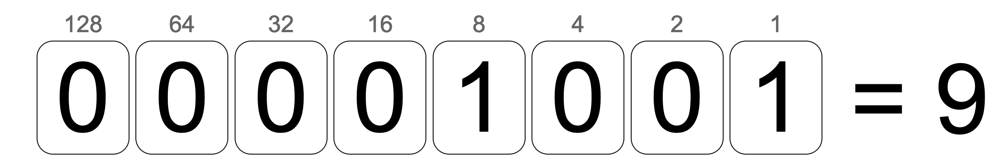

<h2 align=center>Lecture 04</h2>

<h1 align=center>Program Input and Number Systems</h1>

### 2 Jour du Génie, Year CCXXX

***Song of the day***: _[**Esquisse**](https://youtu.be/hcGsPuAMZI8) by 鬼頭明里 Akari Kitō (2022)._

### Sections:

0. [**Review**](#part-0-review)
1. [**Number Systems**](#part-1-number-systems)

### Part 0: _Review_

Let's start with a quick review problem. Let's pretend we have two classroom sizes: one that fits 35 students and one 
that fits 15. Write a program that does the following:

1. Ask the user how large the student body is (i.e. how many students there are).
2. Determine how many 35-student classrooms we can form with this many students.
3. Determine how many 15-student classrooms we can form with the remaining students.
4. Display the results of steps 2 and 3, along with how many students remain leftover.

Number 1 is an easy one; we use the `input()` and `int()` functions. I'm also going to define two variables to store the
sizes of our classrooms, so that I can keep track of them and change them at any point if I so wish:

```python
class_size_a = 35
class_size_b = 15

num_of_students = int(input("How large is the student body? "))
```

Now, for step 2, I'm going to use the same technique we used when we wanted to see how many quarters we could form with
a specific amount of pennies. This time, though, it's not pennies but students, and it's not 25-cent groups, but 
35-student groups. For this, we use the `//` operator:

```python
num_size_a = num_of_students // class_size_a
```

How can we determine how many students remain after this operation? The `%` operator, which gives us the remainder after
a division, should do the trick:

```python
num_of_students = num_of_students % class_size_a
```

Using this amount of remaining students, we can see how many 15-student classrooms we can form by literally repeating 
the same process using `class_size_b` instead of `class_size_a`:

```python
num_size_b = num_of_students // class_size_b
num_of_students = num_of_students % class_size_b  # this is the number of leftover students
```

Finally, step 3 just requires a quick `print()` statement:

```python
print("We formed " + str(num_size_a) + " 35-student classroom(s), " + str(num_size_b) +
      " 15-student classrooms, and have " + str(num_of_students) + " leftover students.")
```

[**Here's**](student_body.py) the full solution.

### Part 1: _Number Systems_

What do we mean when we say "magnitudes bigger than", or "magnitudes smaller than"? Mathematically speaking, for 
something to be a magnitude larger or smaller than another thing, they have to follow the same number system (i.e. you
can't compare apples to oranges, etc.)

Since the world today primarily uses the [**decimal system**](https://en.wikipedia.org/wiki/Decimal) for mathematical 
calculations, when we say `a` is (for example) "3 magnitudes" larger" than `b`, this is what we mean:

> `a` = `b` * 10<sup>3</sup>

So, if `b` equal **42**, `a` would equal **42,000**.

In other words, the number we use to differentiate magnitudes in the decimal, or **base-10**, system is the number 
**10**. We can also tell that this is the case because **there is no single digit to represent 10**. We, instead, have 
to write out ten as a combination of two digits, 1 and 0.

The same is the case for 100. Since we don't have a symbol for 10, we cannot represent 10 tens in a two digit format.
Therefore, we need to use three digits to go up a magnitude (1, 0, and 0).

Another way of thinking of base-10 numbers is as the **sum of numbers multiplied by the powers of 10**:


> 4,034 = 4 * **10<sup>3</sup>** + 0 * **10<sup>2</sup>** + 3 * **10<sup>1</sup>** + 4 * **10<sup>0</sup>** = 4000 + 0 +
> 30 + 4


---

But what about other number systems? Computers, for instance, do use the decimal system to count or do mathematical 
operations. The reason for this is that computers can only do operations in **ones and zeros**. This number system uses
**2** instead of 10 to differentiate between magnitudes. We would, thus, call this system ***binary***, or ***base-2***.

To count from 1 to 10 in binary, then, we would do the following:

|Decimal|Binary|
|-------|------|
|0      |0     |
|1      |1     |
|2      |10    |
|3      |11    |
|4      |100   |
|5      |101   |
|6      |110   |
|7      |111   |
|8      |1000  |
|9      |1001  |
|10     |1010  |

_**Figure 1**: Counting to 10 in [**binary**](https://en.wikipedia.org/wiki/Binary_number#Counting_in_binary)._

Just like decimal assumes that we don't have a symbol for 10, **binary assumes that we don't have a symbol for 2**. 
Therefore, we must count using only the numbers under **2** (i.e. 0 and 1).

Again, just like decimal can be represented as a sum of numbers being multiplied by the powers of 10, **binary numbers
can be represented as a sum of number being multiplied by the powers of 2**. For example:

> (1001)<sub>2</sub> = 1 * **2<sup>3</sup>** + 0 * **2<sup>2</sup>** + 0 * **2<sup>1</sup>** + 1 * **2<sup>0</sup>** = 
> 8 + 0 + 0 + 1 = (9)<sub>10</sub>

We can better illustrate this with the following [**web tool**](https://www.advanced-ict.info/interactive/binary.html):



_**Figure 2**: A visual representation of (1001)<sub>2</sub> to (9)<sub>10</sub>._

If you're given a number in decimal, and have to convert to binary, you can do a simple division and take note of the 
remainders, which end up being your binary number. For example, if we wanted to convert 29 to binary:


_**Figure 3**: Converting (29)<sub>10</sub> to (11101)<sub>2</sub> 
([**source**](https://owlcation.com/stem/How-to-Convert-Decimal-to-Binary-and-Binary-to-Decimal))._

---

You can do this process for just about any number system. Let's try a base-5 system for funsies.

|Decimal|Base-5|
|-------|------|
|0      |0     |
|1      |1     |
|2      |2     |
|3      |3     |
|4      |4     |
|5      |10    |
|6      |11    |
|7      |12    |
|8      |13    |
|9      |14    |
|10     |20    |
|11     |21    |
|12     |22    |
|13     |23    |
|14     |24    |
|15     |30    |
|16     |31    |
|17     |32    |
|18     |33    |
|19     |34    |
|20     |40    |
|21     |41    |
|22     |42    |
|23     |43    |
|24     |44    |
|25     |100   |
|26     |101   |
|27     |102   |
|28     |103   |
|29     |104   |
|30     |110   |

_**Figure 4**: Counting to 30 in base-5._

---

Not all number systems are equally relevant to computer science, however. The second most important base to be aware of
is base-16, or **hexadecimal**.

|Decimal|Hexadecimal |
|-------|------------|
|0      |0           |
|1      |1           |
|2      |2           |
|3      |3           |
|4      |4           |
|5      |5           |
|6      |6           |
|7      |7           |
|8      |8           |
|9      |9           |
|10     |a           |
|11     |b           |
|12     |c           |
|13     |d           |
|14     |e           |
|15     |f           |
|16     |10          |
|17     |11          |
|18     |12          |
|19     |13          |
|20     |14          |

_**Figure 5**: Counting to 20 in [**hexadecimal**](https://en.wikipedia.org/wiki/Hexadecimal)._

As you can see, because in Arabic numerals we don't have a symbol for anything larger than 9, and because we're not 
allowed to use 10 until go up in magnitude, we have to resort to using tokens for these values. You can literally use 
whatever symbol you want as a token, but the well-established convention is to use the letters `a` through `f`.

Why is hex relevant to computer science?

Memory is stored inside your machine in units called **bytes**, which are themselves usually composed 8 bits of 
**bits** (a 1 or a 0). Let's say we have one such byte below:

```text
10111001
```

The reason why hexadecimal is helpful here is that, if we split this byte into two units of 4 bits:

```text
1011 1001
```

Each of those 2 halves can give us a **total of 15 possible bit combinations** before growing in size (magnitude):

1. `0000`
2. `0001`
3. `0010`
4. `0011`
5. `0100`
6. `0101`
7. `0111`
8. `1000`
9. `1001`
10. `1010`
11. `1011`
12. `1100`
13. `1101`
14. `1110`
15. `1111`

What system can only count to 15 before growing in magnitude? Hexadecimal! This, consequently, makes conversions between
decimal and hexadecimal extremely simple _if you know your binary equivalents_:

Let's say we wanted to convert (1967)<sub>10</sub> to both binary and hex.

Using repeated division by 2, we get:

> 1967 / 2 = 983.5 —> **1**
> 
> 983  / 2 = 491.5 —> **1**
> 
> 491  / 2 = 245.5 —> **1**
> 
> 245  / 2 = 122.5 —> **1**
> 
> 122  / 2 = 61    —> **0**
> 
> 61   / 2 = 30.5  —> **1**
> 
> 30   / 2 = 15    —> **0**
> 
> 15   / 2 = 7.5   —> **1**
> 
> 3    / 2 = 1.5   —> **1**
> 
> 1    / 2 = 0.5   —> **1**

Reading from the bottom up, we get **(11110101111)<sub>2</sub>**. Now, split this binary number into groups of four

> **0111 1010 1111**

The decimal equivalents of these three groupings are easy to figure out: **7**, **10**, and **15**. By the same token,
finding the hexadecimal equivalents of 7, 10 and 15 isn't difficult if we are familiar with counting in hex (figure 4):

> (1967)<sub>10</sub> = (11110101111)<sub>2</sub> = **(7af)<sub>16</sub>**.

And just like that, we converted 1967 to all relevant units in one fell swoop!