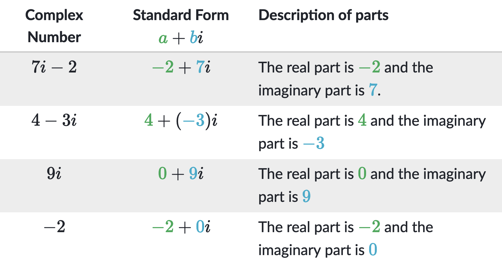

<h2 align=center>Lecture 22</h2>

<h1 align=center>Object-Oriented Programming: "Magic" / Dunder Methods</h1>

### 11 Floréal, CCXXXI

***Song of the day***: _[**Sgt. Pepper's Lonely Hearts Club Band**](https://youtu.be/lsuJqhLl7R8) by The Flaming Lips [feat. My Morning Jacket, Fever the Ghost & J. Mascis] (2014)._

---

### Review: _Mathematical Complex_

In mathematics, a [**complex number**](https://en.wikipedia.org/wiki/Complex_number) is a value that contains a real 
number part (that is, any whole or decimal number) and an imaginary part:




<sub>**Figures 1 & 2**: The general structure of a complex number along with some examples. 
[**Source**](https://www.khanacademy.org/math/algebra2/x2ec2f6f830c9fb89:complex/x2ec2f6f830c9fb89:complex-num/a/intro-to-complex-numbers) </sub>


Performing arithmetic operations on complex numbers is quite simple:

| **Rule**           | **Example**                                    |
|--------------------|------------------------------------------------|
| **Addition**       | `(a + bi) + (c + di) = (a + c) + (b + d)i`     |
| **Subtraction**    | `(a + bi) - (c + di) = (a - c) + (b - d)i`     |
| **Multiplication** | `(a + bi) • (c + di) = (ac - bd) + (ad + bc)i` |

<sub>**Figures 3**: Complex number arithmetic, where `a`, `b`, `c`, and `d` are real numbers.</sub>

Since Python doesn't have a native complex number type, let's create our own class to simulate these numbers and their
behaviour.

---

#### _Creating `Complex` Objects_

Create a class called `Complex` whose objects will be instantiated and behave as follows:

```python
complex_a = Complex(42, 77.0)

print(complex_a.real)
print(complex_b.imaginary)
```

Output:

```text
42
77.0
```

That is, `Complex` objects will all have two attributes: `real` and `imaginary` respectively representing a complex 
number's real and imaginary parts.

<sub>**Optional**: Give both `real` and `imaginary` a default value of `0.0`.</sub>

---

#### _Printing `Complex` Objects_

Add functionality to your `Complex` objects by having them look like this when printed:

```python
complex_a = Complex(42, 77.0)
complex_b = Complex(0.5, -25.0)

print(complex_a)
print(complex_b)
```

Output:

```text
42 + 77.0i
0.5 - 25.0i
```

Notice that whenever the imaginary part of the number is negative, the sign changes (i.e. do not print `0.5 + -25.0i`).

If you chose to do the optional part from the step above, the following should also work (otherwise you can go on to the
next part):

```python
complex_c = Complex(10)
complex_d = Complex(imaginary=-5.07)
complex_e = Complex()

print(complex_c)
print(complex_d)
print(complex_e)
```

Output:

```text
10 + 0.0i
0.0 - 5.07i
0.0 + 0.0i
```

---

#### _Performing Arithmetic on `Complex` Objects_

Define three methods for your `Complex` class:

1. `add_complex()`: Will accept one object of the `Complex` class as a parameter and return another object of the 
`Complex` class with values representing the sum of the two complex numbers.
2. `sub_complex()`: Will accept one object of the `Complex` class as a parameter and return another object of the 
`Complex` class with values representing the difference between the two complex numbers. You can assume the complex
object being passed in as a parameter will be subtracted from the object calling `sub_complex()`. 
3. `mult_complex()`: Will accept one object of the `Complex` class as a parameter and return another object of the 
`Complex` class with values representing the product of the two complex numbers.

Sample behaviour:

```python
complex_a = Complex(42, 77.0)
complex_b = Complex(0.5, -25.0)

summ = complex_a.add_complex(complex_b)
diff = complex_a.sub_complex(complex_b)
prod = complex_a.mult_complex(complex_b)

print(f"Sum: {summ}\nDifference: {diff}\nProduct: {prod}")
```

Output:

```text
Sum: 42.5 + 52.0i
Difference: 41.5 + 102.0i
Product: 1946.0 - 1088.5i
```

---

### _Special / Dunder Methods_

Last class, we learned how to make our objects look nice as a string using `__str__()`. There's actually a whole suite
of these methods that provide more refined functionality to your classes.

These special methods define how classes behave under special circumstances in Python (such as printing, adding, 
equating, etc.) They include **d**ouble **under**score syntax (`"__"`), and so are often called **dunder** (or 
**magic**) methods.

Some of the more common special methods are the following:

- `__str__()`: “Informal” or nicely printable string representation of an object. The return value must be a string 
object.
- `__repr__()`: “Official” string representation of an object. If at all possible, this should look like a valid Python
expression that could be used to recreate an object with the same value. If this is not possible, a string of the form 
`<...some useful description...>` should be returned. The return value must be a string object. If a class defines 
`__repr__()` but not `__str__()`, then `__repr__()` is also used when an “informal” string representation of instances 
of that class is required. This is typically used for debugging, so it is important that the representation is 
information-rich and unambiguous.
- `__len__()`: "Length" of the object. The return value must be an integer.
- `__add__()`: Evaluates the expression `x + y`, where `x` is an instance of a class that has an `__add__()` method, 
`x.__add__(y)` is called.
- `__eq__()`, `__lt__()`, `__le__()`, `__ne__()`, `__gt__()`, `__ge__()`: The correspondence between operator symbols 
and method names is as follows: `x<y` calls `x.__lt__(y)`, `x<=y` calls `x.__le__(y)`, `x==y` calls `x.__eq__(y)`, 
`x!=y` calls `x.__ne__(y)`, `x>y` calls `x.__gt__(y)`, and `x>=y` calls `x.__ge__(y)`. Must return `bool` value.

For example, let's do away with our `add_complex()`, `sub_complex()`, and `mult_complex()` methods and implement some of
the dunder methods from above:

```python
class Complex:
    def __init__(self, real=0.0, imaginary=0.0):
        self.real = real
        self.imaginary = imaginary

    def __add__(self, other):
        real_part = self.real + other.real
        imaginary_part = self.imaginary + other.imaginary
        return Complex(real_part, imaginary_part)

    def __sub__(self, other):
        real_part = self.real - other.real
        imaginary_part = self.imaginary - other.imaginary
        return Complex(real_part, imaginary_part)

    def __mul__(self, other):
        real_part = self.real * other.real - self.imaginary * other.imaginary
        imaginary_part = self.real * other.imaginary - self.imaginary * other.real
        product = Complex(real_part, imaginary_part)

        return product

    def __str__(self):
        return f"{self.real} {"+" if self.imaginary >= 0.0 else "-"} {self.imaginary if self.imaginary >= 0 else abs(self.imaginary)}i")
```

If we do this, we can go ahead and use the `+`, `-`, and `*` operators for more "natural" arithmetic:

```python
complex_a = Complex(42, 77.0)
complex_b = Complex(0.5, -25.0)

summ = complex_a + complex_b
diff = complex_a - complex_b
prod = complex_a * complex_b

print(f"Sum: {summ}\nDifference: {diff}\nProduct: {prod}")
```

```text
Sum: 42.5 + 52.0i
Difference: 41.5 + 102.0i
Product: 1946.0 - 1088.5i
```

Let's say we wanted to implement comparison operators for this class. Equality is easy—let's say that two `Complex`
objects are equal if their `real` and `imaginary` attributes are equal:

```python
class Complex:
    ...
    ...
    def __eq__(self, other):
        return self.real == other.real and self.imaginary == other.imaginary


complex_a = Complex(42, 77.0)
complex_b = Complex(0.5, -25.0)

print(f"({complex_a} == {complex_b}) -> {complex_a == complex_b}")
```

Output:

```text
(42 + 77.0i == 0.5 - 25.0i) -> False
```

How about greater than? While there is no canonical way of comparing complex numbers, a common simplification is to 
use their `real` components to check for `>`. If both of their `real` components are equal, we break the tie by using
their `imaginary` components:

```python
class Complex:
    ...
    ...
    def __gt__(self, other):
        if self.real > other.real:
            return True
        elif self.real == other.real and self.imaginary > other.imaginary:
            return True
        else:
            return False


print(f"({complex_a} > {complex_b}) -> {complex_a > complex_b}")
```

Output:

```text
(42 + 77.0i > 0.5 - 25.0i) -> True
```

We can keep going in this fashion until we have covered all comparison operators, but it is actually quite simple once
you have defined `__eq__()` and `__gt__()` since we can use _those_ in the remaining ones:


```python
class Complex:
    ...
    ...
    def __eq__(self, other):
        return self.real == other.real and self.imaginary == other.imaginary

    def __gt__(self, other):
        if self.real > other.real:
            return True
        elif self.real == other.real and self.imaginary > other.imaginary:
            return True
        else:
            return False
    
    def __ne__(self, other):
        """
        NOT EQUAL
        Makes use of the __eq__() operator, which MUST be defined BEFORE in order to do this
        """
        return not (self == other)

    def __ge__(self, other):
        """
        GREATER THAN
        Makes use of the __eq__() and __gt__() operators, which MUST be defined BEFORE in order to do this
        """
        return self > other or self == other


complex_a = Complex(42, 77.0)
complex_b = Complex(0.5, -25.0)
    
print(f"({complex_a} != {complex_b}) -> {complex_a != complex_b}")
print(f"({complex_a} >= {complex_b}) -> {complex_a >= complex_b}")
```

Output:

```text
(42 + 77.0i != 0.5 - 25.0i) -> True
(42 + 77.0i >= 0.5 - 25.0i) -> True
```

In a similar fashion, we can easily define behavior for `<` and `<=` using our other comparison operators:

```python
class Complex:
    ...
    ...
    def __lt__(self, other):
        return not (self >= other)

    def __le__(self, other):
        return self < other or self == other


complex_a = Complex(42, 77.0)
complex_b = Complex(0.5, -25.0)
    
print(f"({complex_a} < {complex_b}) -> {complex_a < complex_b}")
print(f"({complex_a} <= {complex_b}) -> {complex_a < complex_b}")
```

Output:

```text
(42 + 77.0i < 0.5 - 25.0i) -> False
(42 + 77.0i <= 0.5 - 25.0i) -> False
```

---

One more useful thing to know about `__repr__()` is the following.

Check out the following behavior:

```python
# A list of Complex objects
complex_numbers = [
    Complex(imaginary=1.0, real=20.0), 
    Complex(),
    Complex(0.005, 25.4)
]

print(complex_numbers)
```

Output:

```text
[<__main__.Complex object at 0x7f8da00769d0>, <__main__.Complex object at 0x7f8da0076a30>, <__main__.Complex object at 0x7f8da0076a90>]
```

Why is this happening? We defined our `Complex` class's `__str__()` method, didn't we? It turns out that, when being 
represented inside containers, objects use their `__repr__()` string representation, not their `__str__()` string 
representation. So if we implement that, we should be able to fix this:

```python
class Complex:
    ...
    ...
    def __repr__(self):
        return str(self)  # taking advantage of the __str__() implementation
```

```text
[20.0 + 1.0i, 0.0 + 0.0i, 0.005 + 25.4i]
```