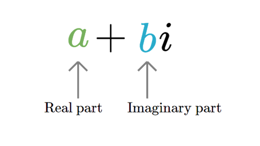
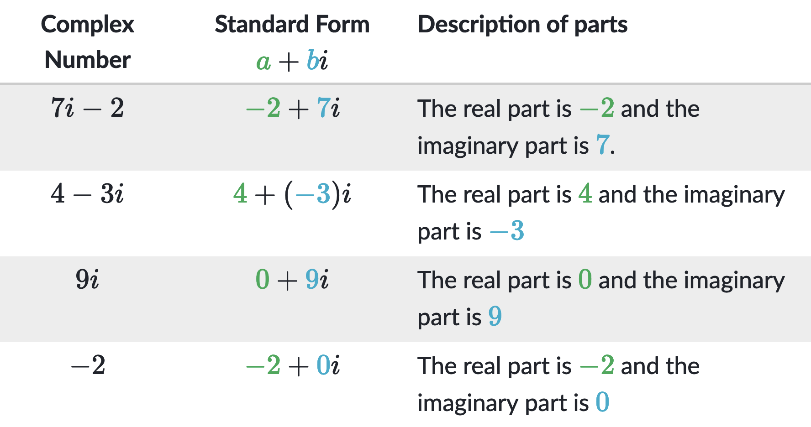

<h2 align=center>Lecture 25</h2>

<h1 align=center>Object-Oriented Programming: "Magic" / Dunder Methods</h1>

### 15 Frimaire, CCXXXI

***Song of the day***: _[**DES FLEURS COMME CALMANTS**](https://youtu.be/kiGsno5q1jI) by TRENTE (2020)._

---

### Review: _Mathematical Complex_

In mathematics, a [**complex number**](https://en.wikipedia.org/wiki/Complex_number) is a value that contains a real 
number part (that is, any whole or decimal number) and an imaginary part:




<sub>**Figures 1 & 2**: The general structure of a complex number along with some examples. 
[**Source**](https://www.khanacademy.org/math/algebra2/x2ec2f6f830c9fb89:complex/x2ec2f6f830c9fb89:complex-num/a/intro-to-complex-numbers) </sub>


Performing arithmetic operations on complex numbers is quite simple:

| **Rule**           | **Example**                                    |
|--------------------|------------------------------------------------|
| **Addition**       | `(a + bi) + (c + di) = (a + c) + (b + d)i`     |
| **Subtraction**    | `(a + bi) - (c + di) = (a - c) + (b - d)i`     |
| **Multiplication** | `(a + bi) • (c + di) = (ac - bd) + (ad + bc)i` |

<sub>**Figures 3**: Complex number arithmetic, where `a`, `b`, `c`, and `d` are real numbers.</sub>

Since Python doesn't have a native complex number type, let's create our own class to simulate these numbers and their
behaviour.

---

#### _Creating `Complex` Objects_

Create a class called `Complex` whose objects will be instantiated and behave as follows:

```python
complex_a = Complex(42, 77.0)

print(complex_a.real)
print(complex_b.imaginary)
```

Output:

```text
42
77.0
```

That is, `Complex` objects will all have two attributes: `real` and `imaginary` respectively representing a complex 
number's real and imaginary parts.

<sub>**Optional**: Give both `real` and `imaginary` a default value of `0.0`.</sub>

---

#### _Printing `Complex` Objects_

Add functionality to your `Complex` objects by having them look like this when printed:

```python
complex_a = Complex(42, 77.0)
complex_b = Complex(0.5, -25.0)

print(complex_a)
print(complex_b)
```

Output:

```text
42 + 77.0i
0.5 - 25.0i
```

Notice that whenever the imaginary part of the number is negative, the sign changes (i.e. do not print `0.5 + -25.0i`).

If you chose to do the optional part from the step above, the following should also work (otherwise you can go on to the
next part):

```python
complex_c = Complex(10)
complex_d = Complex(imaginary=-5.07)
complex_e = Complex()

print(complex_c)
print(complex_d)
print(complex_e)
```

Output:

```text
10 + 0.0i
0.0 - 5.07i
0.0 + 0.0i
```

---

#### _Performing Arithmetic on `Complex` Objects_

Define three methods for your `Complex` class:

1. `add_complex()`: Will accept one object of the `Complex` class as a parameter and return another object of the 
`Complex` class with values representing the sum of the two complex numbers.
2. `sub_complex()`: Will accept one object of the `Complex` class as a parameter and return another object of the 
`Complex` class with values representing the difference between the two complex numbers. You can assume the complex
object being passed in as a parameter will be subtracted from the object calling `sub_complex()`. 
3. `mult_complex()`: Will accept one object of the `Complex` class as a parameter and return another object of the 
`Complex` class with values representing the product of the two complex numbers.

Sample behaviour:

```python
complex_a = Complex(42, 77.0)
complex_b = Complex(0.5, -25.0)

summ = complex_a.add_complex(complex_b)
diff = complex_a.sub_complex(complex_b)
prod = complex_a.mult_complex(complex_b)

print("Sum: {}\nDifference: {}\nProduct: {}".format(summ, diff, prod))
```

Output:

```text
Sum: 42.5 + 52.0i
Difference: 41.5 + 102.0i
Product: 1946.0 - 1088.5i
```