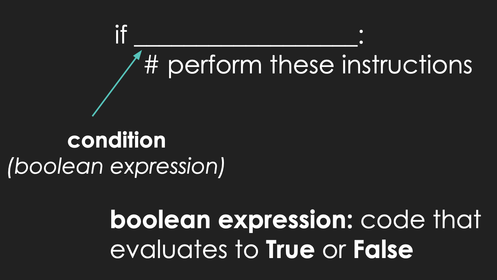

<h2 align=center>Lecture 05</h2>

<h1 align=center>Selection Statements: <code>if</code>, <code>elif</code>, and <code>else</code>.</h1>

<h3 align=center>16 Pluviôse, Year CCXXXI</h3>

***Song of the day***: _[**Body Talk**](https://youtu.be/Oo_NIdBUzMU) by Red Velvet (2017)._

### Sections:

0. [**Module Practice**](#part-0-module-practice)
1. [**`if`-Statements**](#part-1-if-statements)
2. [**`else`-Statements**](#part-2-else-statements)
3. [**`elif`-Statements**](#part-3-elif-statements)
4. [**Common Mistakes**](#part-4-common-mistakes)

### Part 0: _Module Practice_

Ask the user two input two numbers (you can assume that they will always enter numerical characters). Then, write a program that will generate a random integer between `0` and `100`, inclusive on both ends. Finally, your program should print the boolean value `True` if:
 - Both numbers fall between `0` and the random number (inclusive on both ends), or if...
 - The value of the first number divided by the second number falls between `0` and the random number (inclusive on both ends).

Otherwise, your program should print the boolean value `False`. If you know what they are, you may _not_ use selection statements (`if`, `elif`, `else`).

The solution is fairly straight forward if you are comfortable with _conditional statements_. Asking for input from the user, as well as generating a random number shouldn't be too bad either:

```python
# import the random module for random value generation
import random

# asking the user for their two numbers and immediately converting them into float values
number_one = float(input("Enter a number: "))
number_two = float(input("Enter another number: "))

# Generating a random number between and including 0 and 100
random_number = random.randrange(0, 101)​
```

Printing `True` or `False` is a matter of remembering that _all conditional expressions evaluate to either `True` or `False`_. For example, if we execute the following line:

```python
print(3 < 4)
```

Our output will be

```
True
```

The only difference between this and our solution is that the conditional expression is a bit more complicated than `3 < 4`, but the idea is exactly the same:

```python
print(0 <= number_one <= random_number and 0 <= number_two <= random_number or 0 <= number_one / number_two <= random_number)
```

Here, the computer is simply printing the value of this boolean expression. That's it. It is not actually deciding whether to print `True` or to print `False`. It's not like it is aware of what to do in case either case happens to be the result of the expression. It's closer to seeing `5` being printed after asking Python to evaluate `print(3 + 2)`; there are no choices being made, it's just a simple printing of a boolean value.

Why does this matter? Well, a good number of students, and perhaps you yourself, may have been tempted to interpret the problem in the following way:

> **If** both numbers lie in the range [0, random number), _or_ **if the ratio of both numbers lies within the range [0, random number), then please print the word `"True"`. If not, then print the word `"False"`.

This may sounds extremely similar to the description above, but there's a very subtle, important difference: in this last interpretation, you are implying that **the computer is making a choice between printing `True` or printing `False` depending on the conditions that it was given.** That is: it looks at the result of the boolean expression, and from then it chooses one of **two execution paths depending on the result**:


```
 INTERPRETATION 1:                  │ INTERPRETATION 2: 
                                    │
        boolean expression result   │           boolean expression result
                │                   │            /                     \
                │                   │           /                       \
                │                   │          V                         V
                │                   │        True?                     False?
                │                   │          │                         │
                │                   │          │                         │
                V                   │          V                         V
              print                 │      print "True"              print "False"
                                    │         
```
<sub>**Figure 1**: Two ways of looking at the instructions. In interpretation 1, the result of a boolean expression is being printed. In interpretation 2, the boolean expression is evaluated and, depending on the result, the computer will print either of the two words (True or False).</sub>

The ability to determine whether something is true or not, and performing different sets of instructions accordingly, is hugely important to computer science; it is what determines whether we get access to our email accounts, whether a bank's fraud alert system blocks your account if it sees suspicious activity, and whether an autonomous vehicle changes lanes depending on the traffic surrounding it. We have done something similar above, but something is missing.

It turns out that just being able to determine whether something is true or not is not quite enough for this program to be very useful. In fact, what makes Python, and all programming languages, (infinitely, literally) more powerful than being simply fancy calculators that can solve inequalities is not their ability to tell us whether something is true or not, but rather ***its ability to do different sets of instructions whether something is true or not***. (In fact, the ability to do this is the single thing that makes a computer [**Turing complete**](https://en.wikipedia.org/wiki/Turing_completeness). If you don't know what this is and/or want to watch an amazing video talking about it, click [**here**](https://youtu.be/AqNDk_UJW4k)).

To give a familiar example, what if we wanted our program above to not only tell us whether both numbers lie in the range [0, random number), or if the ratio of both numbers lies within the range [0, random number), but we also wanted to display personalised messages depending on whether the condition evaluates to True and, if it doesn't for it to tell us why:

```
Enter a number: 42
Enter another number: 77
The ratio is between 0 and 25 so the the expression evaluates to true.
```

So, let's learn how to do this.

### Part 1: _`if`-Statements_

The first of these selection statements is the mother of all computer science structures—the `if` statement. Here's the
basic Python syntax:



If we wanted to say this in plain English, it would just simply say:

> **If** a certain condition is **true**, perform these instructions **once**.

For example, let's say that we were programming NYU's COVID screening system, and a use can only enter the building if
they are a student **and** if they are triple vaccinated:

```python
student_status_input = input("Is this student's ID active? [y/n] ")
booster_status_input = input("Has this student received their COVID-19 booster shot? [y/n] ")

is_student = student_status_input == 'y'
is_triple_vaxxed = booster_status_input == 'y'

if is_student and is_triple_vaxxed:
    # Statements that are indented under an if-statement will execute if is_student and is_triple_vaxxed are both true
    print("This student is allowed in the building.")
```

This would read as:

> **If** this person is a student **and if** this person has had their booster shot, then print the following message:
> 
> `"This student is allowed in the building if they are a student and if they are triple-vaccinated."`

Notice that I don't say here `"if they are a student and are triple-vaccinated"`. This is because Python considers each
clause **completely independent** of others. For example, imagine that a certain instruction would only be executed if
the user input was either `'y'` or `'Y'`. This would have to be written in Python as such:

```python
user_input = input("Would you like to continue? [y/n] ")

if user_input == 'y' or user_input == 'Y':
    # Do something
```

You should ***not*** tye it this way, in other words:

```python
user_input = input("Would you like to continue? [y/n] ")

if user_input == 'y' or 'Y':
    # Do something
```

Why? Because, read as a Python interpreter, this would read as:

> If the value of `user_input` is equal to `'y'`, **or** the value of `'Y'` is `True`, then execute.

And this is clearly not what we're trying to say. So you have to be careful when writing your conditions; just because 
something reads a certain way in English, it does not necessarily mean that it translates exactly into Python.

### Part 2: _`else`-Statements_

So now we know how to have an instruction or set instructions execute whenever a condition or set of conditions are 
true. So what happens in the case where we want a specific set of instructions to execute when a condition evaluates to 
false? Let's say a certain American alcohol-related website asks you to input your birth-year, and if it determines that
you are under 21, it will give you a different message. If we only use `if`-statements, we cannot achieve this sort of
"forking", since the program's flow will always go from top to bottom:

```python
CURRENT_YEAR = 2022
AMERICAN_DRINKING_AGE = 21

user_age = int(input("What year were you born in? "))
difference = CURRENT_YEAR - user_age  # here, we assume that the input will always <= 2022

if difference >= AMERICAN_DRINKING_AGE:
    print("Welcome!")
```

<sub>**Note**: Look at the syntax for constant values (`CURRENT_YEAR` and `AMERICAN_DRINKING_AGE`). This is the correct
way to define constants in Python, regardless of which case system you are using. I will be using this convention in 
class from now on.</sub>

In order to add a second "option" for this program to execute in such case that this user is under 21, we need to use
the complementary statement to `if`: the `else`-statement:

```python
CURRENT_YEAR = 2022
AMERICAN_DRINKING_AGE = 21

user_birth_year = int(input("What year were you born in? "))
difference = CURRENT_YEAR - user_birth_year  # here, we assume that the input will always <= 2022

if difference >= AMERICAN_DRINKING_AGE:
    print("Welcome!")
else:
    # Statements that are indented under the else-statement will only execute if the value of difference is under 21
    print("No entry for underage users.")
```

This, in English, would read as:

> **If** the value of `difference` is greater than or equal to the value of `AMERICAN_DRINKING_AGE`, print `"Welcome!"`.
> **Or else** (i.e. if it is **not** greater than or equal to the value of `AMERICAN_DRINKING_AGE`) print `"No entry for
> underage users."`.

Or, perhaps more closely following Python syntax:

> Execute `print("Welcome!")` **if** the expression `difference >= AMERICAN_DRINKING_AGE` evaluates to `True`, or 
> **else** (i.e. if not) execute `print("No entry for underage users.")`.

Either way of reading it describes the same behaviour. See the sample executions below:

```commandline
What year were you born in? 1993
Welcome!
```
```commandline
What year were you born in? 2004
No entry for underage users.
```

There are a couple of things of note about the `else` keyword:

- It cannot exist by itself. It needs to be preceded by either an `if`- or an `elif`-statement. More about the latter in
a bit.
- It does not take a condition after it, the way `if` does. In other words, you cannot do the following:

```python
if difference >= AMERICAN_DRINKING_AGE:
    print("Welcome!")
else difference < AMERICAN_DRINKING_AGE:  # WRONG
    print("No entry for underage users.")
```

This makes sense if you think about the fact that an `if`-`else` structure represents a **binary** fork in your program.
In other words, if it is not one, it _has_ to be the other, so there's no need to tell Python what the other is.

This can pose a bit of danger when writing certain programs because if you don't cover all of your bases, the
`else`-statement can execute in unexpected cases:

```python
LIMIT = 100.0

height = float(input("Enter any value under 100.0 for the height of your rectangle: "))
width = float(input("Enter any value under 100.0 for the width of your rectangle: "))

if height < LIMIT and width < LIMIT:
    area_of_rectagle = height * width
    print("The area of your rectangle is:", area_of_rectagle)
else:
    print("Please enter values under 100.0")
```
When executed:
```commandline
Enter any value under 100.0 for the height of your rectangle: 42
Enter any value under 100.0 for the width of your rectangle: -50.45
The area of your rectangle is: -2118.9
```

Naturally, negative lengths and areas don't make any sense, but the only condition you gave Python in your 
`if`-statement was that the value should be under `100.0`; you didn't account for the possibility of values < `0.0`. A
better implementation of this program might instead be:

```python
LOWER_LIMIT = 0.0
UPPER_LIMIT = 100.0

height = float(input("Enter any value under 100.0 for the height of your rectangle: "))
width = float(input("Enter any value under 100.0 for the width of your rectangle: "))

if LOWER_LIMIT < height < UPPER_LIMIT and LOWER_LIMIT < width < UPPER_LIMIT:
    area_of_rectagle = height * width
    print("The area of your rectangle is:", area_of_rectagle)
else:
    print("Please enter positive values under 100.0")
```
Sample execution:
```commandline
Enter any value under 100.0 for the height of your rectangle: 42
Enter any value under 100.0 for the width of your rectangle: -54.45
Please enter positive values under 100.0
```

### Part 3: _`elif`-Statements_

I actually think we can do better that the implementation above. Especially with ranges, you might have a specific set
of instructions execute if "condition 1" is true, a different set if "condition 2" is true, a third set if "condition 3"
is true, etc.. A lot of "choices" in programming and software development are not simply binary, but rather can include 
three, four, or even thousands of different paths depending on the situation. For example, let's go back to our 
age-check program. If the user enters a negative number, our site will of course not let them in. But what if we wanted
to instead tell them that the value that they entered is invalid, instead of telling them that they are underaged? This 
may seem like a minor change, but in terms of user experience, it may make a world of difference for the clients using
your web app.

In programming, we can achieve this multi-branching by using the "else if" statement, or the `elif`-statement in Python.

```python
CURRENT_YEAR = 2022
AMERICAN_DRINKING_AGE = 21

user_age = int(input("What year were you born in? "))
difference = CURRENT_YEAR - user_age

if user_age < 0:
    print("Invalid input")
elif difference >= AMERICAN_DRINKING_AGE:
    print("Welcome!")
else:
    print("No entry for underage users.")
```

This, in English, would read as:

> If the value of `user_age` is negative, print `"Invalid input"`. 
> 
> If the value of `difference` is greater than or equal to the value of `AMERICAN_DRINKING_AGE`, print `"Welcome!"`.
> 
> If neither of these conditions are true, then 
> print `"No entry for underage users."`.

Immediately we notice the biggest difference between `elif` and `else`: just like `if`-statements, `elif`-statements
**must take a condition**.

This is because you are telling Python to consider several sets of options. It will consider them all in order, and if
none of them evaluate to `True`, it will execute whatever instructions exist under the `else`-statement, if any.

The great thing about `elif`, too, is that you can have several of them in one `if`-`elif`-`else` block. What happens if
the user enters a year that is greater than 2022? The value of `difference` would then be negative:

```commandline
What year were you born in? 2030
No entry for underage users.
```

While this is...technically true, it still doesn't make much sense. A better way to implement this program would be:

```python
CURRENT_YEAR = 2022
AMERICAN_DRINKING_AGE = 21

user_age = int(input("What year were you born in? "))
difference = CURRENT_YEAR - user_age

if user_age < 0:
    print("Invalid input")
elif difference < 0:
    print("No entry for unborn users.")
elif difference >= AMERICAN_DRINKING_AGE:
    print("Welcome!")
else:
    print("No entry for underage users.")
```
Output:
```commandline
What year were you born in? 2030
No entry for unborn users.
```

### Part 4: _Common Mistakes_

Two things happen rather often when first starting out with branching.

---

The first is the order of your `if`s and `elifs`. What would have happened it my age check code were instead implemented
this way:

```python
CURRENT_YEAR = 2022
AMERICAN_DRINKING_AGE = 21

user_age = int(input("What year were you born in? "))
difference = CURRENT_YEAR - user_age

if difference >= AMERICAN_DRINKING_AGE:
    print("Welcome!")
elif user_age < 0:
    print("Invalid input")
elif difference < 0:
    print("No entry for unborn users.")
else:
    print("No entry for underage users.")
```

We are still checking for the same four different possibilities, right? The big problem here is that Python does **not**
check all four options at the same time. It checks them one-by-one, from top to bottom.

```commandline
What year were you born in? -40
Welcome!
```

That's clearly not right. What happened here is that Python first checked the `if`-statement condition, which only cares
about `difference` being less than `AMERICAN_DRINKING_AGE`. If we enter `-40` for our birth year, the value of 
`difference` would be `2062`. So, yeah, you can drink if you are 2062 years old, but that is not the point here. We have
a very specific set of instructions to execute in such case that the user enters a negative number.

In general, the broadest conditions should go first, and get more specific as you add more `elif`-statements.

---

The second thing that always comes up is the question:

> How do I know if I should use `elif`s or just several `if`-statements?

Let's replace all of our `elif`-statements from before and see what happens:

```python
CURRENT_YEAR = 2022
AMERICAN_DRINKING_AGE = 21

user_age = int(input("What year were you born in? "))
difference = CURRENT_YEAR - user_age

if difference >= AMERICAN_DRINKING_AGE:
    print("Welcome!")
if user_age < 0:
    print("Invalid input")
if difference < 0:
    print("No entry for unborn users.")
else:
    print("No entry for underage users.")
```

- _Example #1_:
```commandline
What year were you born in? 1993
Welcome!
No entry for underage users.
```

- _Example #2_:
```commandline
What year were you born in? >? -1989
Welcome!
Invalid input
No entry for underage users.
```

What went wrong? The problem here is that **every time Python sees an `if`-statement, it will execute it**. In other 
words, using only `if`-statements is not like taking a single path of a series of option, but rather like taking several
single paths of only two options.

---

<sub>**Previous: [Number Systems and Python Modules](/lectures/number_systems)** || **Next: [Control-Flow Structures: The `while`-Loop](/lectures/while_loops)**</sub>