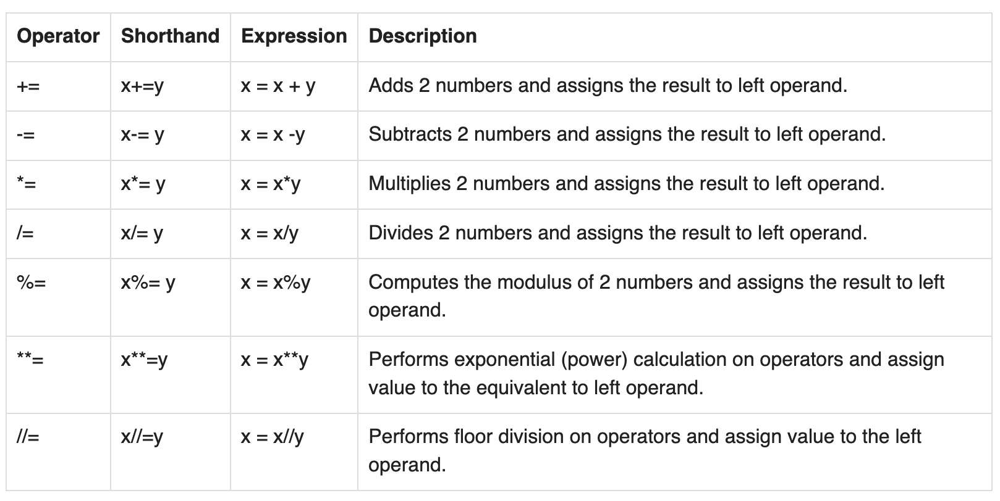
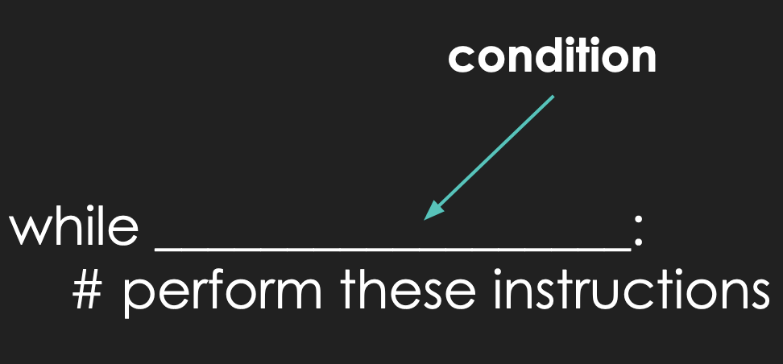

## Lecture 08

# Control Flow Structures: `while`-loops

### 28 Pluviôse Year CCXXX

***Song of the day***: _[**Transitor Lover**](https://youtu.be/dIyocZ5q4lw) by Milk Talk (2021)._

---

### Part 0: _Shortcut ("Assignment") Operators_

Here's a table of Python's shortcut operators and their long-form equivalents. I will pretty much be using them every
time the situation demands it, so just be aware of what they mean:



_**Figure 1**: Shortcut operators in Python ([**source**](https://www.w3resource.com/python/python-operators.php#ass-op))._

These are sometimes also called "assignment operators", since technically you are reassigning a value to the same 
variable based on its previous value. I prefer calling them shortcut operators, but it is something to keep in mind.

### Part 1: _Selection Statements Review_

Here goes one of the most popular programming interview questions out there: write a program that does the following:

1. Asks the user to enter any integer.
2. If this integer is divisible by 3, print the string `"Sound!"`.
3. If this integer is divisible by 5, print the string `"Euphonium"`.
4. If this integer is divisible by both 3 and 5, print the string `"Sound! Euphonium"`.

Let's take care of step 1:

```python
user_input = int(input("Please enter any integer: "))
```

It's probably pretty obvious that this is an `if`-`elif`-`else` situation—it's just a question of how we structure it.

An extremely common answer to the rest of the steps in this question is the following:

```python
user_input = int(input("Please enter any integer: "))

if user_input % 3 == 0:
    print("Sound!")
elif user_input % 5 == 0:
    print("Euphonium")
elif user_input % 3 == 0 and user_input % 5 == 0:
    print("Sound! Euphonium")
```

This is actually incorrect. Let's try a couple of inputs to see why:

- _Divisible by neither 3 nor 5:_
```commandline
Please enter any integer: 1
```
- _Divisible by 3:_
```commandline
Please enter any integer: 3
Sound!
```
- _Divisible by 5:_
```commandline
Please enter any integer: 5
Euphonium
```
- _Divisible by both 3 and 5:_
```commandline
Please enter any integer: 15
Sound!
```

So, why did this happen? The reason this question trumps people (even professionals) is that they forget that, while 
`if`-`elif`-`else` structures make a single decision from a series of options depending on which condition is true, it
checks each condition **in order**, from top to bottom.

In other words, the way we have our code formatted above will first check if a number is divisible by 3. If it is not,
it will check if it is divisible by 5, and if it's not, it will finally check whether it's divisible by both 3 and 5.

So, if the integer is 15, then the `user_input % 3 == 0` test will pass and execute, and the other two tests will be
skipped over completely. Again, the general strategy is to place your most encompassing tests first, and specialise as
you go down. The correct way to set this test up is [**thus**](sound_euphonium.py):

```python
user_input = int(input("Please enter any integer: "))

if user_input % 3 == 0 and user_input % 5 == 0:
    print("Sound! Euphonium")
elif user_input % 3 == 0:
    print("Sound!")
elif user_input % 5 == 0:
    print("Euphonium")
```

### Part 2: _Loops_

I've been really emphasising making sure that the user enters "the correct input" whenever we do problems in class. For
instance, last time, we wrote a short program asking the user if they would like to continue or not, like in a video 
game after you've lost all your lives:

```python
user_choice = input("Continue? [y/n] ")

if user_choice == 'y':
    print("Continuing...")
elif user_choice == 'n':
    print("Game over!")
```

A couple of you made a very good point by asking one of two questions: 

1. How do we make sure that the user enters one of the four options in our program (`'y'` and `'n'`) and
nothing else?
2. If the user _does_ input an invalid character, can we continue to ask them to enter characters until they enter the 
correct one?

The answer to the first question is simple: you can't. So long as it is human beings using your software, you cannot 
ever guarantee that they will perform the correct steps, every single time. This is why checking for correct input using
selection statements is so important, and why I always emphasise it.

What about the answer to the second question? The answer is that, of course, we can. Software since the beginning of 
user interfaces have asked users for input, and allowed them to re-enter input if they do not recognise it. In other 
words, **they continue to execute their user input mechanisms until the user enters a recognisable one**. Or, put 
another way:

> The program will run **while** the user enters the wrong input.

Similar to an `if`-statement, it will check if the input is valid. Once it is not, it will repeat itself. If it is 
valid, the program will stop looping that same instruction, and the program will continue onto the next line that is not
part of the loop.

Something, maybe, that would look like this pseudo-code example:

```text
IF user_choice != 'y' AND user_choice =! 'n'
    REPEAT user_choice = input("Continue? [y/n] ")
```

This happens all the time in computer science. An instagram story is displayed **while** the twenty-four hour period is
not over. A video game character can continue fighting **while** their health is not 0.

So, how do we achieve this in Python? With our first loop of the semester, the `while`-loop.

### Part 3: _`while`-loops_

The general syntactical structure of a Python `while`-loop is as follows:



<sub>**Figure 1**: Notice the indentation of the instructions—similar to an `if`-statement.</sub>

This, in English, would read as:

> **While** `condition` remains `True`, perform these instructions **indefinitely**.

To apply this syntax to our yes/no example from above, we would do the [**following**](game_over.py):

```python
user_choice = input("Continue? [y/n] ")

while user_choice != 'y' and user_choice != 'n':
    user_choice = input("Continue? [y/n] ")

if user_choice == 'y':
    print("Continuing...")
elif user_choice == 'n':
    print("Game over!")
```

In English, we would read this as:

> While `user_choice` does _not_ equal `'y'` and `user_choice` does _not_ equal `'n'`, execute the line `user_choice = 
> input("Continue? [y/n] ")` **indefinitely**.

In other words, as soon as `user_choice` equals `'y'` or `'n'`, the loop condition will be false, and we will exit the
loop completely.

Check out the following sample behaviour:

```text
Continue? [y/n] q
Continue? [y/n] c
Continue? [y/n] n
Game over!
```

If we read the code in order, from top to bottom, the steps would be:

1. We ask the user for the first input.
2. The user enters `'q'`.
3. The `while`-loop condition is evaluated. `user_choice` is not equal to `'y'` and is not equal to `'n'`.
4. The `while`-loop condition simplifies to `True`, so we enter the `while`-loop.
5. We ask the user for input again.
6. The user enters `'c'`. 
7. The `while`-loop condition is evaluated. `user_choice` is not equal to `'y'` and is not equal to `'n'`.
8. The `while`-loop condition simplifies to `True`, so we enter the `while`-loop again.
9. We ask the user for input again.
10. The `while`-loop condition is evaluated. `user_choice` is not equal to `'y'`, but it is equal to `'n'`.
11. The `while`-loop condition simplifies to `False`, so we **do not** enter the `while`-loop again.
12. The `if`-statement condition is evaluated. `user_choice` is not equal to `'y'`, so the line indented under it is
**not** executed.
13. The `elif`-statement condition is evaluated. `user_choice` is equal to `'n'`, so the line indented under it is
executed.
14. The string `"Game over!"` is printed.
15. The program ends.

---

`while`-loops can also be used in numerical contexts. For example, if we were programming a video game where the user
gains a new life after collecting 100 coins, we could do something like this:

```python
import random

NEW_LIFE_COINS = 100

coin_amount = 0
life_amount = 1

print("STARTING LIVES:", life_amount)
print("STARTING COINS:", coin_amount)

while coin_amount < NEW_LIFE_COINS:
    random_coin_amount = random.randrange(1, 21)  # let's say the user can only gain a max of 20 coins per turn
    coin_amount += random_coin_amount
    print("GAINED COINS: " + str(random_coin_amount) + ". CURRENT COINS: " + str(coin_amount))

life_amount += 1

print("ENDING LIVES:", life_amount)
print("ENDING COINS:", coin_amount)

```

Potential output:

```commandline
STARTING LIVES: 1
STARTING COINS: 0
GAINED COINS: 7. CURRENT COINS: 7
GAINED COINS: 19. CURRENT COINS: 26
GAINED COINS: 15. CURRENT COINS: 41
GAINED COINS: 17. CURRENT COINS: 58
GAINED COINS: 12. CURRENT COINS: 70
GAINED COINS: 4. CURRENT COINS: 74
GAINED COINS: 6. CURRENT COINS: 80
GAINED COINS: 18. CURRENT COINS: 98
GAINED COINS: 7. CURRENT COINS: 105
ENDING LIVES: 2
ENDING COINS: 105
```

In other words, once the `while`-loop starts, the condition `coin_amount < NEW_LIFE_COINS` will be evaluated. As long as
it evaluates to `True` (i.e. as long as `coin_amount` is less than `NEW_LIFE_COINS`), a random number of coins between 1
and 20 will be generated and added to `coin_amount`. At some point, `coin_amount` will _not_ be less than 
`NEW_LIFE_COINS`, and we will exit the `while`-loop completely.

---

You may have noticed this already, but `while`-loops are primarily used in situations where **the programmer doesn't
necessarily know when the loop is going to stop**. We don't know when the user will decide to enter either `'y'` or 
`'n'`. We don't know how many random generated numbers it will take for our coin amount to go over 100. In this way,
our program may never end. This would not be our fault—we are giving the user instructions, and they can choose to never
enter the correct input.

There is, however, one very dangerous situation where a `while`-loop would never end, and it would be our fault. This is
what is called an **infinite loop**. Take a look at the following example:

```python
LIMIT = 10

counter = 0

while counter <= LIMIT:
    user_input = float(input("Enter a number to add to our counter: "))

print("The final value of our counter is:", counter)
```

If we tried to run this program, we would never exit the `while`-loop. Ever. Why? Because while we are asking the user
to enter a value to add to `counter`, we never actuall **add it** to `counter`. This mistake is super super super easy
to make. It happens to *me* all the time. To fix it, all we have to do is:

```python
LIMIT = 10

counter = 0

while counter <= LIMIT:
    user_input = float(input("Enter a number to add to our counter: "))
    counter += user_input

print("The final value of our counter is:", counter)
```

---

Oh and, before anybody asks, the use of the `break` keyword is ***absolutely forbidden*** in this class. The situations
where it is absolutely necessary are so few and far between that if you find yourself needing it in this class, you are
doing something wrong.